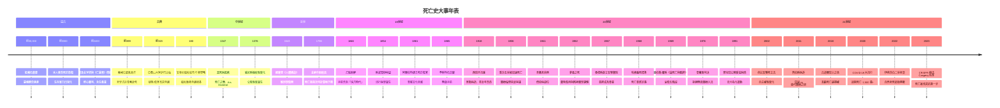

# 附錄C：死亡觀與醫療制度大事年表

橫跨五萬年的時間軸，左欄是「人類做了什麼」，右欄是「人類怎麼想死亡」。技術與觀念從來不是兩條平行線，而是互相驅動的雙螺旋。

```mermaid
timeline
    title 死亡史大事年表
    section 遠古
        前30,000 : 紅赭石墓葬 : 靈魂觀念萌芽
        前3300 : 冰人奧茨死於箭傷 : 生存暴力日常化
        前2400 : 埃及金字塔與《亡靈書》傳統 : 秤心審判、永生產業
    section 古典
        前399 : 蘇格拉底飲毒芹 : 哲學式的尊嚴赴死
        前323 : 亞歷山大猝逝巴比倫 : 瘧疾/傷寒改寫帝國
        180 : 安東尼瘟疫殺馬可·奧理略 : 瘟疫動搖帝國根基
    section 中世紀
        1347 : 黑死病抵歐 : 死亡之舞、Ars Moriendi
        1376 : 威尼斯檢疫制度化 : 公衛制度誕生
    section 近世
        1543 : 維薩里《人體構造》 : 解剖學復興
        1796 : 金納牛痘疫苗 : 死亡率首次可計算地下降
    section 19世紀
        1846 : 乙醚麻醉 : 手術告別「快刀時代」
        1854 : 斯諾寬街地圖 : 流行病學誕生
        1861 : 阿爾伯特親王死於傷寒 : 喪服文化全盛
        1865 : 李斯特石炭酸 : 無菌手術
    section 20世紀
        1918 : 西班牙流感 : 席勒病逝、青壯年浩劫
        1936 : 喬治五世被加速死亡 : 醫療倫理首波爭議
        1941 : 青黴素首例 : 傳染病退位
        1962 : 夢露之死 : 藥物濫用與精神醫學課題
        1967 : 桑德斯創立安寧醫院 : 善終成為專業
        1968 : 哈佛腦死標準 : 死亡重新定義
        1969 : 庫伯勒-羅斯《論死亡與臨終》 : 哀傷五階段
        1976 : 奎蘭案判決 : 拒絕無效醫療入法
        1991 : 摩克瑞公開愛滋病情 : 去污名化運動
    section 21世紀
        2002 : 荷比安樂死立法 : 自主權制度化
        2011 : 賈伯斯病逝 : 實證 vs 替代醫療之辯
        2018 : 古道爾瑞士之旅 : 高齡死亡選擇權
        2020 : COVID-19 大流行 : 過剩死亡 1,500 萬+
        2022 : 伊莉莎白二世老衰 : 自然老死最後典範
        2023 : CRISPR 療法 Casgevy 核准 : 死亡被改寫的第一步
```

年表的最後一格是未完成的：CRISPR、AI 與數位永生正在書寫下一行，但五萬年前埋下第一座墓葬的人類，追問的仍是同一個問題——如何面對必然的終點。這個問題的答案，將由下一位讀者續寫。
