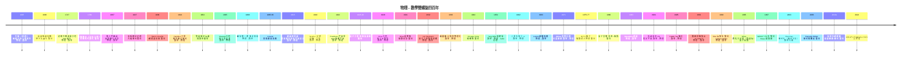

# 附錄 A：物理與數學相互驅動時間軸

```mermaid
timeline
    title 物理↔數學雙螺旋四百年
    1687 : 牛頓《原理》 微積分為力學而生 物理→數學
    1696 : 最速降線挑戰 變分法誕生 雙向
    1747 : 達朗貝爾波動方程 PDE 誕生 物理→數學
    1788 : 拉格朗日《分析力學》 對稱的代數化 雙向
    1807 : 傅立葉熱論 函數概念革命 物理→數學
    1827 : 高斯絕妙定理 內蘊幾何 雙向
    1836 : Sturm-Liouville 譜理論前奏 雙向
    1844 : Hamilton 力學 相空間辛幾何 數學→物理
    1854 : 黎曼幾何演講 純數學蓄勢
    1865 : Maxwell 方程 預言電磁波 數學→物理
    1889 : 龐加萊三體 混沌發現 物理→數學
    1895-96 : Lorentz 变換/塞曼效應
    1915 : 廣義相對論 黎曼幾何成為宇宙語言 數學→物理
    1918 : Noether 定理 對稱⇔守恆 數學→物理
    1922 : Friedmann 宇宙學 ODE 描繪宇宙 數學→物理
    1925-26 : 量子力學 矩陣與波動 雙向
    1928 : Dirac 方程 預言反物質 數學→物理
    1931 : Dirac 磁單極 陳類前身 雙向
    1932 : von Neumann 量子力學數學基礎 物理→數學
    1936 : 圖靈機 計算的物理化 數學→物理
    1944 : Onsager Ising 精確解 雙向
    1954 : Yang-Mills 規範場 數學→物理 ; KAM 定理
    1962 : 八重法預言 Ω⁻ 數學→物理
    1963 : Lorenz 蝴蝶效應 物理→數學
    1971 : Wilson 重整化群 尺度即群 數學→物理
    1975-77 : BPST 瞬子 陳類進入物理 雙向
    1980 : 量子霍爾 電導=陳數 雙向
    1983 : Donaldson 理論 物理→數學
    1984 : 弦論革命 E8 裁定宇宙 數學→物理
    1985 : Calabi-Yau 緊化 數學→物理
    1991 : 鏡像對稱算出 317206375 物理→數學
    1994 : Shor 演算法 雙向 ; Seiberg-Witten 物理→數學
    1995 : Wiles 費馬大定理（數論端） ; 量子糾錯
    1997 : AdS/CFT 全息 雙向 ; Kitaev 環面碼
    2003 : Perelman 幾何化（幾何分析） 數學內部
    2006 : Kapustin-Witten 幾何朗蘭茲 雙向
    2010s : 拓撲序/模範疇 張量網路=幾何 雙向
    2024 : AlphaProof/AlphaGeometry AI 進場
```
