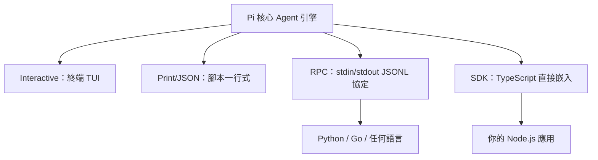

# 1.2 四大執行模式：Interactive / Print / RPC / SDK

## 從一個問題開始

一個 agent 工具若只會在終端機裡跟你聊天，那它只是一個玩具。Pi 用**同一個核心**提供四種執行模式，讓它能嵌入腳本、其他語言、甚至你的應用程式。

## 四大模式總覽

| 模式 | 啟動方式 | 用途 |
|---|---|---|
| **Interactive** | `pi` | 完整 TUI 終端互動體驗 |
| **Print / JSON** | `pi --print "..."` / `--mode json` | 腳本自動化、事件流處理 |
| **RPC** | `pi --mode rpc` | 跨語言整合（Python、Go…）、IDE |
| **SDK** | `import { createAgentSession }` | 嵌入 Node.js / Bun 應用程式 |



## Interactive Mode：終端 TUI

直接執行 `pi` 進入全螢幕 TUI：對話記錄、編輯器、footer 狀態列（資料夾、會話、模型、context 用量、累計費用）。

```bash
pi
```

日常操作關鍵：

- `Enter` 送出提示、`Shift+Enter` 換行、`Ctrl+G` 呼叫外部編輯器寫長提示
- `@` 搜尋檔案插入提示、`Tab` 補路徑
- `Ctrl+O` 展開/收合工具輸出、`Ctrl+T` 顯示/隱藏思考區塊
- `Escape` 中止當前任務
- `!` 前綴直接跑終端指令並把輸出放進對話（`!!` 不送輸出給模型）

## Print / JSON Mode：腳本自動化

```bash
pi --print "Summarize this repository"        # 執行一次，輸出最終回應，然後結束
git diff | pi --print "Review this change"    # 管線輸入也會被併進提示
pi --mode json "Inspect this repository" > events.jsonl   # 輸出 JSONL 事件流
```

| 輸入 | 行為 |
|---|---|
| `message` | 初始提示 |
| `@path` | 第一個提示帶入檔案或圖片 |
| 管線 stdin | 內容前置到第一個提示 |
| `--` | 停止解析選項，讓提示可以以 `-` 開頭 |

當 stdin 或 stdout 被重新導向時，Pi 自動使用 print mode。

## RPC Mode：跨語言 stdin/stdout 串接

Pi 跑成長駐子程序，用 JSONL 協定溝通：stdin 收指令、stdout 回應與事件。

```bash
pi --mode rpc --no-session
```

```json
{"id":"req-1","type":"prompt","message":"Review this repository"}
{"id":"req-1","type":"response","command":"prompt","success":true,"data":{"disposition":"started"}}
```

重點規則：

- 每個指令可帶 `id`，回應會重複該 `id` 供配對；指令是非同步的，要用 ID 配對而非順序
- 嚴格 JSONL 分框：一個完整 JSON 物件 + LF 換行（不要用 Node 的 `readline`，它會把 `U+2028/2029` 也當換行）
- `prompt` 回應成功只代表「已接受」，要等 `agent_settled` 事件才代表工作全部結束
- 關閉子程序 stdin 即請求 orderly shutdown

Python 最小客戶端範例：

```python
import json, subprocess

process = subprocess.Popen(["pi", "--mode", "rpc", "--no-session"],
                           stdin=subprocess.PIPE, stdout=subprocess.PIPE)

command = {"id": "prompt-1", "type": "prompt", "message": "Hello"}
process.stdin.write(json.dumps(command).encode() + b"\n")
process.stdin.flush()

while line := process.stdout.readline():
    record = json.loads(line)
    if record.get("type") == "message_update":
        update = record["assistantMessageEvent"]
        if update["type"] == "text_delta":
            print(update["delta"], end="", flush=True)
    elif record.get("type") == "agent_settled":
        break

process.stdin.close()
process.wait()
```

## SDK Mode：嵌入你的 Node.js 應用

```typescript
import { createAgentSession } from "@earendil-works/pi-coding-agent";

const { session } = await createAgentSession();
try {
  await session.prompt("What files are in the current directory?");
  console.log(session.getLastAssistantText());
} finally {
  session.dispose();
}
```

SDK 提供與 CLI 完全相同的能力：sessions、tools、models、extensions、events。`prompt()` 在執行結束後才 resolve；要串流輸出就先訂閱事件：

```typescript
const unsubscribe = session.subscribe((event) => {
  if (event.type === "message_update" && event.assistantMessageEvent.type === "text_delta") {
    process.stdout.write(event.assistantMessageEvent.delta);
  }
});
```

> 真實世界整合案例：[OpenClaw](https://github.com/OpenClaw/OpenClaw) 就是用 Pi SDK 打造的。

## 怎麼選？

| 你要做的事 | 選這個 |
|---|---|
| 日常寫 code、對話 | Interactive |
| CI 腳本、shell 自動化、code review | Print |
| 分析事件流、建 pipeline | JSON mode |
| Python / Go / Rust 整合、IDE 外掛 | RPC |
| 把 agent 嵌進自己的 TypeScript 應用 | SDK |

> 打比方：Pi 像一台汽車引擎——Interactive 是開著它上路，Print 是用它跑固定班次的接駁車，RPC 是把引擎裝進別人家的車，SDK 是直接把引擎當零件焊進你的產品。
