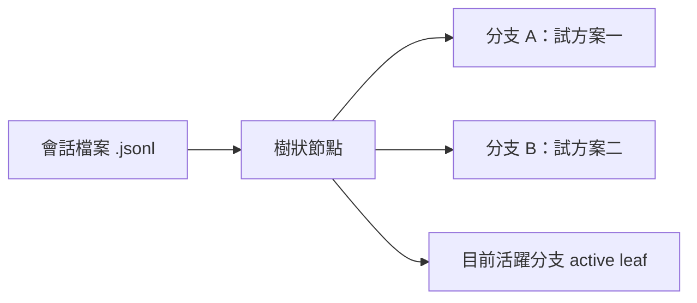

# 2.1 樹狀會話：單一檔案，無限分支

## 從一個問題開始

傳統 agent 工具的對話歷史是一條直線——你回到上一個問題，後面的對話就被覆蓋刪除。Pi 把會話存成**樹（tree）**：回到任何一個節點分岔，原本的分支都還在，**全部活在同一個檔案裡**。

## 會話的儲存方式

Pi 自動儲存會話（除非 `--no-session`）：

| 路徑 | 說明 |
|---|---|
| `~/.pi/agent/sessions/` | 預設儲存位置，**依工作資料夾分組** |
| `--session-dir <dir>` | 指定其他位置（優先權最高） |
| `--no-session` | 不持久化，程式結束即消失 |



- 每個會話是一棵**樹**，模型收到的是「活躍分支」，不是檔案裡的每個分支
- 分岔只改變 active leaf，**不刪除被放棄的分支**
- 重建模型 context 時，取活躍分支並套用 compaction

## 繼續與切換會話

```bash
pi --continue        # 接續此專案最近的會話（-c）
pi --resume          # 開啟會話選擇器（-r）
```

互動模式內：

```text
/new        # 開新會話
/resume     # 開啟會話選擇器（可搜尋、改名、刪除）
/name <名稱> # 給會話一個好認的名字
/session    # 顯示會話檔案、ID、訊息數、token 用量與費用
```

離開 Pi 之後，回到同一個資料夾執行 `pi --continue` 即接續最近的會話。

## 三種分岔動作

| 動作 | 結果 | 適用時機 |
|---|---|---|
| `/tree` | 在**同一個會話檔案內**移動 | 相關的替代方案放在一起 |
| `/fork` | 從較早的使用者訊息**另開新會話** | 替代方案要變成獨立工作 |
| `/clone` | 把活躍分支**複製成新會話** | 想要目前狀態的獨立副本 |

> 打比方：/tree 像同一本筆記本裡跳頁寫（舊頁都留著）；/fork 像撕下一頁裝訂成新本子；/clone 像把整本影印一份從中間續寫。

## CLI 選項補充

```bash
pi --session <path|id>    # 用路徑或 ID 開會話
pi --session-id <id>      # 開指定 ID 或不存在就建立
pi --fork <path|id>       # 從既有會話分岔成新會話
pi --name <name>          # 設定會話名稱
```

> 注意：`--fork` 不能與 `--session` / `--continue` / `--resume` / `--no-session` 併用。

## 為什麼樹狀歷史重要

解決複雜問題時，你經常需要「開平行分支試錯」：

1. 試方案 A，走三步，發現不對
2. `/tree` 回到岔路口，試方案 B
3. 方案 A 的完整過程仍保留在樹上，隨時可以回去看「當時為什麼不行」
4. 分支還能加書籤（label）、按訊息類型過濾

這是 Pi 相對於其他 agent 工具最獨特的能力之一。
