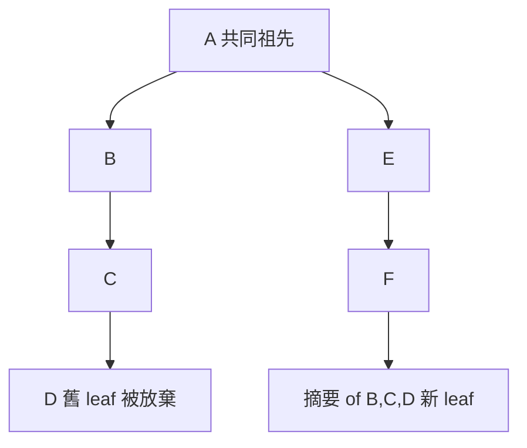

# 2.2 /tree：在對話分支間自由穿梭與書籤

## 從一個問題開始

會話是一棵樹，那怎麼在樹上移動？答案是 `/tree`——互動式的樹狀導航器。

## 基本操作

```text
/tree        # 開啟樹狀導航器
```

在 `/tree` 裡：

- **選擇一條使用者訊息**：它的文字會被放回編輯器——修改後送出，就從該點創造一條**新分支**
- **選擇一條 assistant 回應**：從該條目之後繼續，編輯器是空的
- 離開分支時，Pi 可以**摘要你離開的分支**，把摘要掛到你要進入的分支上——保留被放棄路徑的相關工作，又不用塞進每一條訊息

## 樹上的過濾與書籤

| 快捷鍵 | 功能 |
|---|---|
| `Ctrl+D` | 樹過濾：預設檢視 |
| `Ctrl+T` | 隱藏 tool results |
| `Ctrl+U` | 只顯示使用者訊息 |
| `Ctrl+L` | 只顯示有書籤的條目 |
| `Ctrl+A` | 顯示全部條目 |
| `Ctrl+O` / `Shift+Ctrl+O` | 循環切換過濾模式 |
| `Shift+L` | 編輯選中節點的書籤（label） |
| `Shift+T` | 切換書籤時間戳顯示 |
| `Ctrl+左/右` | 摺疊/展開目前分支段，或跳到上/下一段 |

> 書籤（label）的用處：標記重要決策點，之後用「只顯示有書籤的條目」過濾，快速回顧整個會話的決策史。

## 分支摘要（Branch Summarization）

用 `/tree` 切換分支時，Pi 會詢問是否摘要你正在離開的分支：

1. 找出新舊位置的**共同祖先**（deepest common ancestor）
2. 從舊 leaf 回走收集條目（受 token 預算限制，新的優先）
3. 呼叫 LLM 生成結構化摘要
4. 在導航點附加 `BranchSummaryEntry`



摘要格式包含 Goal、Constraints & Preferences、Progress、Key Decisions、Next Steps，並附上累計追蹤的讀取/修改檔案清單。

## 讀檔案清單的累計追蹤

預設摘要會從被摘要的訊息裡萃取 tool call 的檔案操作，並**跨多次 compaction 與巢狀分支摘要累計**。也就是說：即使經過好幾輪摘要，「這個會話動過哪些檔案」的清單始終不會丟失。

## 何時用 /tree、/fork、/clone？

| 情境 | 用什麼 |
|---|---|
| 「這個方案走不通，回到岔路試別的，但想留在同一個會話」 | `/tree` |
| 「這個替代路線要變成獨立工作，可能要交給別人或另開主題」 | `/fork` |
| 「我想要目前狀態的乾淨副本，從這裡繼續」 | `/clone` |

## 匯入舊會話

```text
/import <path>    # 匯入並接續一個 JSONL 會話
```

> JSONL 就是會話檔的格式——樹狀條目一條一條存，完整契約見官方 [Session Format](https://github.com/earendil-works/pi/blob/main/packages/coding-agent/docs/session-format.md)。
