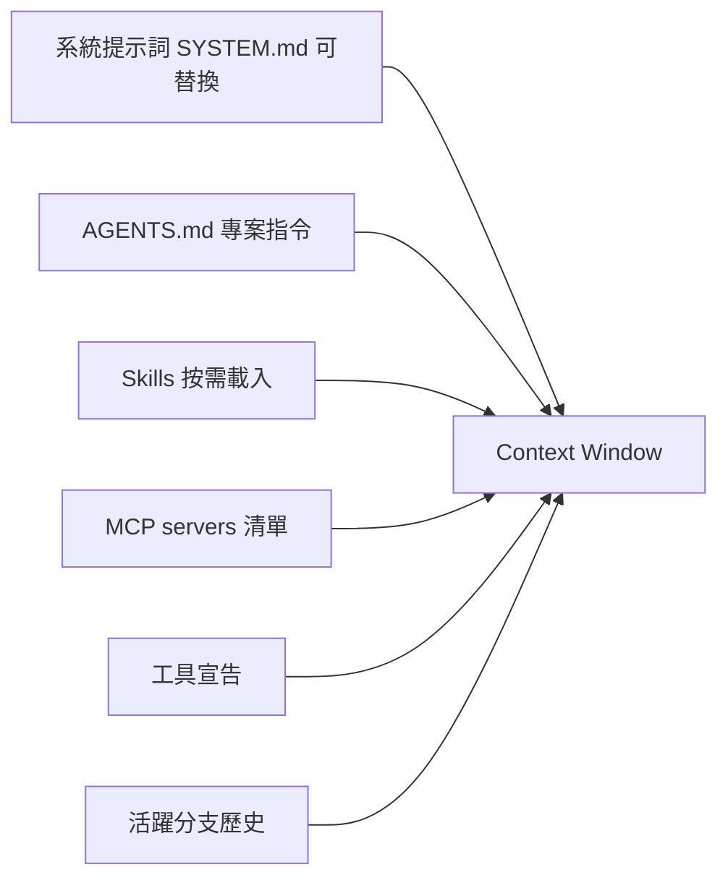

# 3.1 指令檔架構：AGENTS.md 與 SYSTEM.md

## 從一個問題開始

你希望 agent 一啟動就知道這個專案的規矩——用什麼測試、哪些目錄不能動、code style 是什麼。Pi 的答案是兩層指令檔：**AGENTS.md（專案上下文）** 與 **SYSTEM.md（系統提示詞）**。

## AGENTS.md：專案層級指令

Pi 從三個地方載入 AGENTS.md：

| 位置 | 範圍 |
|---|---|
| `~/.pi/agent/AGENTS.md` | 使用者全域（跨所有工作資料夾） |
| 工作資料夾與其父目錄 | 專案層級（一路向上搜尋） |
| 當前資料夾 | 最貼近工作的層級 |

- 也支援 `CLAUDE.md`（相容既有習慣）
- `AGENTS.override.md` **只取代同目錄**的 `AGENTS.md` 或 `CLAUDE.md`
- context file 的發現**不需要 project trust**
- `AGENTS.md` 適用於它所在的目錄與其下所有目錄

## SYSTEM.md：自訂系統提示詞

Pi 的系統提示詞刻意**極簡**（原始碼只有一個檔案），你可以在每個專案替換或附加：

| 檔案 | 作用 |
|---|---|
| `.pi/SYSTEM.md` | **取代** Pi 的預設系統提示詞（僅此專案） |
| `.pi/APPEND_SYSTEM.md` | **附加**到系統提示詞（僅此專案） |
| `~/.pi/agent/SYSTEM.md` | 全域取代 |
| `~/.pi/agent/APPEND_SYSTEM.md` | 全域附加 |

CLI 也能直接指定：

```bash
pi --system-prompt ./instructions.md          # 取代
pi --append-system-prompt ./extra.md          # 附加（可重複）
pi -nc                                        # 停用 AGENTS.md / CLAUDE.md 發現
```

> 同名的 SYSTEM.md，**信任的專案檔優先於** agent 目錄檔，不會合併。

## `.pi` 專案設定目錄總覽

| 路徑 | 責任 |
|---|---|
| `.pi/settings.json` | 專案層級設定與套件宣告 |
| `.pi/mcp.json` | 專案 MCP 伺服器 |
| `.pi/SYSTEM.md` / `.pi/APPEND_SYSTEM.md` | 專案系統提示詞 |
| `.pi/extensions/` | 專案擴充 |
| `.pi/skills/` | 專案技能 |
| `.pi/prompts/` | 專案提示模板 |
| `.pi/themes/` | 專案主題 |

對應的使用者全域目錄在 `~/.pi/agent/`（settings.json、keybindings.json、mcp.json、models.json、auth.json、extensions/、skills/、prompts/、themes/）。

## Project Trust（專案信任）

專案的 `.pi/` 設定會在 Pi 程序內**執行程式碼**，所以：

1. 首次進入專案，Pi 會問你是否信任
2. 只有信任後，專案的 settings、extensions、skills、prompts、packages 才會載入
3. `/trust` 可儲存信任決定供未來使用
4. 想跳過：`-a`（`--approve`）信任，`-na`（`--no-approve`）忽略

> ⚠️ 檢視不熟悉的專案前，先看它有沒有 `.pi/` 設定與 extensions——它們可能在 Pi 程序內執行。

## 上下文工程的完整拼圖

Pi 的極簡系統提示詞 + 可替換設計，讓你真正掌控 context window 裡放了什麼：



控制手段：AGENTS.md / SYSTEM.md（本章）、Skills 漸進載入（3.2）、Compaction 壓縮（3.3）、Extensions 動態注入（第四章）。
