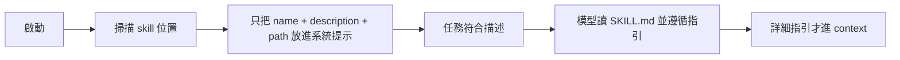

# 3.2 Skills 與 Prompt Templates：漸進式揭露

## 從一個問題開始

你想給 agent 一套「PDF 處理」的完整指引，但不想讓這幾千字常駐 context window——大部分對話根本用不到。Pi 的答案是 **Skills**：宣告名稱與描述，**任務需要時才載入完整指引**。

## Skills：按需載入的能力包

Pi 實作 [Agent Skills 規範](https://agentskills.io/specification)。一個 skill 就是一個含 `SKILL.md` 的資料夾：

```text
pdf-tools/
├── SKILL.md
├── scripts/
│   └── extract.sh
├── references/
│   └── formats.md
└── assets/
    └── template.json
```

`SKILL.md` 內容：

```markdown
---
name: pdf-tools
description: Extract text and tables from PDF files. Use when reading, converting, or inspecting PDFs.
---

# PDF tools

Read `references/formats.md` before converting a document. Run scripts relative to this skill directory.
```

## 漸進式揭露（Progressive Disclosure）的機制



關鍵：**描述決定模型何時考慮載入**。描述要寫「做什麼 + 何時用」，不要只寫「Helps with PDFs」這種含糊話。

## 放哪裡？

| 位置 | 範圍 |
|---|---|
| `~/.pi/agent/skills/` | 使用者全域 |
| `.pi/skills/` | 專案（需 trust） |
| `~/.agents/skills/`、`.agents/skills/` | Agent Skills 標準位置 |
| `--skill <path>` | 一次性載入 |

## 手動強制載入

模型可能漏載相關 skill，需要時直接強制：

```text
/skill:pdf-tools extract report.pdf
```

`/skill:name` 後面的參數會作為使用者請求附加到載入的指引上。frontmatter 設 `disable-model-invocation: true` 可讓 skill 只能透過顯式指令使用（不自動觸發）。

## frontmatter 欄位

| 欄位 | 用途 |
|---|---|
| `name` | 指令與顯示名稱（小寫、數字、連字號，最長 64 字） |
| `description` | 路由描述（最長 1024 字） |
| `license` | 授權 |
| `compatibility` | 環境需求 |
| `metadata` | 額外鍵值 |
| `allowed-tools` | 實驗性預核准工具清單 |
| `disable-model-invocation` | 隱藏自動觸發 |

> 大多數無效欄位只會警告，不會中斷啟動。名稱與目錄名不同 Pi 不強制，但為了可移植性（其他 Agent Skills 實作會強制），建議保持一致。

## Prompt Templates：把 Markdown 變成 / 指令

想要重複使用同一個提示，但不需要可執行行為？**Prompt template** 就是一個 Markdown 檔，檔名即指令名：

建立 `~/.pi/agent/prompts/review.md`：

```markdown
---
description: Review staged git changes
argument-hint: "[focus]"
---
Review the staged changes. Focus on ${1:-correctness, security, and error handling}.
```

使用：

```text
/review
/review concurrency
```

### 參數替換語法

| 語法 | 結果 |
|---|---|
| `$1`, `$2`, … | 位置參數 |
| `$@` 或 `$ARGUMENTS` | 所有參數以空格連接 |
| `${1:-default}` | 第一個參數，或預設值 |
| `${@:N}` | 從位置 N 開始的參數 |
| `${@:N:L}` | 從位置 N 開始的 L 個參數 |

參數遵循 shell 式引號規則：`/review "API compatibility"` 是一個含空格的參數。

## Skills vs Prompt Templates：怎麼選？

| | Skill | Prompt Template |
|---|---|---|
| 內容 | 指引 + 腳本 + 參考檔 + 資產 | 純提示文字 |
| 載入時機 | 任務符合描述時按需載入 | 輸入 `/name` 時展開 |
| 可執行行為 | 可附腳本供模型執行 | 無 |
| 適用 | 需要大量上下文與支援檔 | 需要重複使用的固定提示 |

> 編輯 skill 或 template 後，在活躍會話內執行 `/reload` 立即生效。範例合集：[Anthropic skills](https://github.com/anthropics/skills)、[Pi skills](https://github.com/badlogic/pi-skills)。
