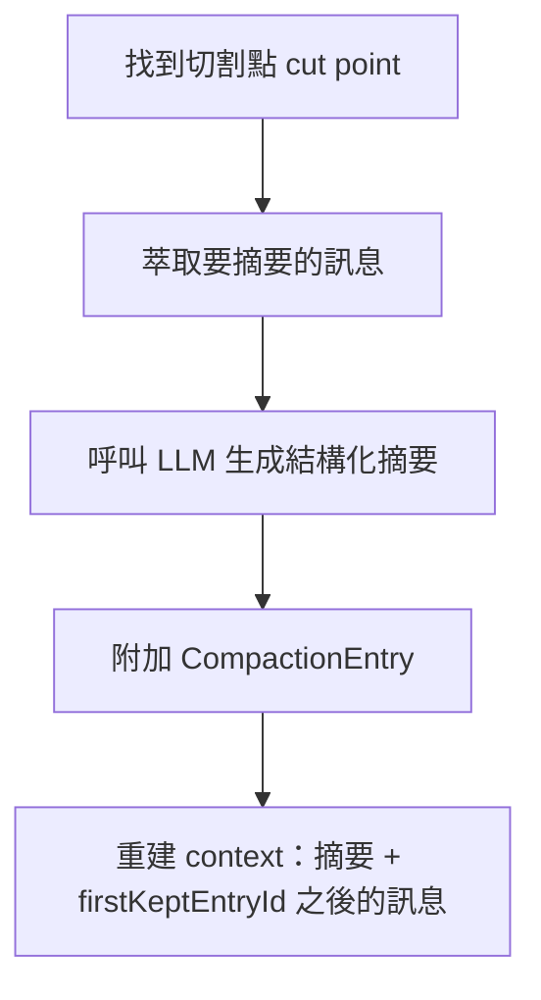

# 3.3 Compaction：上下文壓縮與自訂摘要

## 從一個問題開始

長時間的 agent 工作會把 context window 塞爆——舊訊息越積越多。Pi 的答案是 **Compaction**：接近上限時自動把舊訊息摘要成一則結構化總結，保留近期訊息，**原始條目不刪除**。

## 觸發時機

```
contextTokens > contextWindow - reserveTokens
```

預設 `reserveTokens` 為 **16384 tokens**（留給 LLM 的回應）。觸發點有三個：

1. 多輪 agent run 中，工具結果附加後、下一個回應開始前
2. 新的使用者提示進來前
3. 低階 run 結束後的最終搶救（overflow recovery）

也可以手動觸發：

```text
/compact [指示]    # 可帶指示，讓摘要保留特定主題或決策
```

## 運作流程



- 從尾端回走累計 token，直到保留 `keepRecentTokens`（預設 **20000**）的近期訊息
- 切割點永遠不會切在 tool result 上（工具結果必須跟著它的 tool call）
- 摘要請求會停用 prompt-cache 寫入（一次性提示不會被重複使用）

## 摘要格式

Compaction 摘要是結構化的，包含：

```markdown
## Goal            ← 使用者想完成什麼
## Constraints & Preferences  ← 使用者提過的要求
## Progress        ← Done / In Progress / Blocked
## Key Decisions   ← 決策與理由
## Next Steps      ← 接下來該做什麼
## Critical Context ← 續作需要的資料
<read-files>...</read-files>
<modified-files>...</modified-files>
```

> 檔案清單跨多次 compaction **累計追蹤**——即使摘要了好幾輪，「動過哪些檔案」始終不丟失。工具結果序列化時截斷到 2000 字元，保持摘要請求的 token 預算合理。

## 設定

`~/.pi/agent/settings.json` 或 `.pi/settings.json`：

```json
{
  "compaction": {
    "enabled": true,
    "reserveTokens": 16384,
    "keepRecentTokens": 20000
  }
}
```

| 設定 | 預設 | 說明 |
|---|---|---|
| `enabled` | `true` | 啟用自動 compaction |
| `reserveTokens` | `16384` | 給 LLM 回應保留的 tokens |
| `keepRecentTokens` | `20000` | 不被摘要的近期 tokens |

### 依模型調整（modelOverrides）

1M context 的大模型，可以把觸發門檻調高：

```json
{
  "compaction": {
    "modelOverrides": {
      "some-provider/big-model": {
        "reserveTokens": 400000
      }
    }
  }
}
```

> key 是精確的 `provider/modelId`（區分大小寫），其他模型維持普通設定。`enabled` 是全域的，不依模型。

## 常見問題

| 症狀 | 說明 |
|---|---|
| Compaction 失敗 | 提供商不可用或拒絕摘要請求——修好 provider 再 `/compact` 一次 |
| 關閉自動 compaction | `"enabled": false`，但手動 `/compact` 仍可用 |
| 原始條目會不見嗎？ | 不會。Compaction 只是附加摘要條目，原始歷史、匯出、費用總計都還查得到 |

## 自訂 Compaction：Extension 攔截

Pi 的 compaction 完全可透過 extension 自訂——實作主題式摘要、code-aware 摘要、或用不同的摘要模型：

```typescript
import { convertToLlm, serializeConversation } from "@earendil-works/pi-coding-agent";

pi.on("session_before_compact", async (event, ctx) => {
  const { preparation, customInstructions, reason, signal } = event;

  // 把 AgentMessage[] 轉成文字
  const conversationText = serializeConversation(
    convertToLlm(preparation.messagesToSummarize)
  );

  // 用自己的模型生成摘要
  const { summary, usage } = await myModel.summarize(conversationText);

  return {
    compaction: {
      summary,
      firstKeptEntryId: preparation.firstKeptEntryId,
      tokensBefore: preparation.tokensBefore,
      usage,
    },
  };
});
```

相關事件：

- `session_before_compact`：compaction 前攔截，可取消（`{ cancel: true }`）或提供自訂摘要
- `session_compact_failed`：失敗時通知（做遙測用）
- `session_before_tree`：`/tree` 分支摘要前攔截，可取消導航或自訂摘要

> 分支摘要（branch summarization）與 compaction 用同一套機制——`/tree` 切換分支時的摘要見 2.2。
