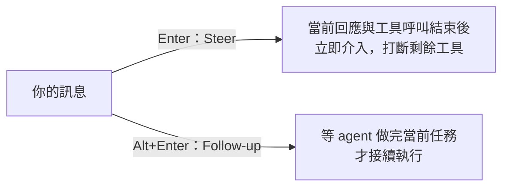

# 3.4 Steer 與 Follow-up：Agent 工作中途的人工干預

## 從一個問題開始

Agent 正在跑一個長任務，你發現它方向不對——等它做完再說？太浪費。直接打斷？前面的進度全沒了。Pi 的答案是 **Steer（中途轉向）** 與 **Follow-up（佇列追加）**：兩種訊息、兩種時機。

## 兩種中途訊息

Pi 工作中隨時可以送訊息：

| 你想做什麼 | 動作 |
|---|---|
| **修正當前任務**（Steer） | 輸入訊息按 `Enter` |
| **排隊追加工作**（Follow-up） | 輸入訊息按 `Alt+Enter` |
| 把佇列的訊息拿回編輯器 | `Alt+Up` |
| 中止當前任務 | `Escape` |



- **Steer**（`Enter`）：在當前回應與其工具呼叫完成後送入，**打斷剩餘的工具呼叫**，引導下一個回應
- **Follow-up**（`Alt+Enter`）：**等 agent 完全做完當前任務**才送入，不中斷

> 打比方：Steer 像副駕駛看到路況不對立刻喊「左轉！」；Follow-up 像在行程表上再加一站——車子開完這段才接新的。

SDK 的對應 API：

```typescript
session.steer()      // 轉向當前 run，回傳 "queued" 或 "handled"
session.followUp()   // 追加到 run 結束後
session.abort()      // 中止並等待閒置
session.waitForIdle() // 只等，不中止
```

> 正在串流時呼叫 `prompt()` 而不指定轉向或追加，會直接被拒絕——Pi 不替你猜。

## ! 與 !!：直接跑終端指令

在編輯器裡以 `!` 開頭：

```text
!git status       # 執行指令，輸出放進對話（模型看得到）
!!git status      # 執行指令，輸出不送給模型
```

用 `!` 查狀態、跑測試、看 log，比叫 agent 去跑更快更可控。

## 中止與佇列行為

- `Escape` 中止當前任務，**佇列裡的訊息會退回編輯器**，不會丟失
- `Alt+Up` 隨時把佇列訊息拿回來改
- 中止後 agent 變閒置，你可以重新下指令或 `/tree` 回到岔路

## Windows 的替代鍵

Windows Terminal 保留了部分 Alt 快捷鍵。替代組合（Windows / WSL）：

| 功能 | macOS/Linux | Windows/WSL |
|---|---|---|
| Follow-up 訊息 | `Alt+Enter` | `Ctrl+Q` |
| 取回佇列訊息 | `Alt+Up` | `Alt+Q` |
| 循環切換模型（反向） | `Shift+Ctrl+P` | `Alt+P` |
| 貼上剪貼簿 | `Ctrl+V` | `Alt+V` |

完整對應見 `/hotkeys`（顯示當前會話生效的快捷鍵）。

## 為什麼這很重要

一般 agent 工具的工作節奏是「下指令 → 等 → 檢查 → 再下指令」，人在等待中被閒置。Pi 的 Steer / Follow-up 讓你**持續參與**：

1. 送出任務後繼續看它工作
2. 發現方向不對 → `Enter` 送 steering 訊息，即時修正
3. 想到還有下一件事 → `Alt+Enter` 排隊
4. 全程不用等它停下來

> 這也是 Pi「少彈窗、快節奏」哲學的一部分：它假設你會盯著看，所以不做每步確認，換來的是隨時介入的能力。
