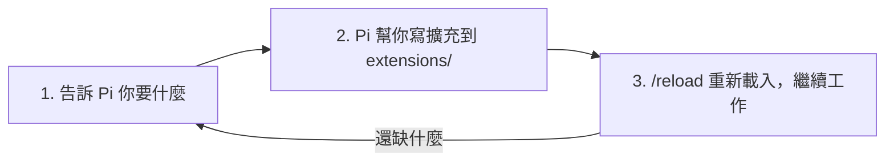

# 5.1 讓 Pi 為自己寫擴充：自我修改的 Agent

## 從一個問題開始

Pi 不是封閉產品。如果你需要一個指令、一個工具、一個提供商、一個工作流程或 UI 調整——**直接叫 Pi 幫你寫**。它會即時修改自己。

## 官方原話

> "Pi isn't a sealed product. If you need a command, tool, provider, workflow, or UI tweak, just ask Pi to build it. It will customize itself on the fly."
>
> "Have Pi manipulate itself in place, hit `/reload`, and keep going."

## 實戰流程：三步循環



### 第一步：描述你要的東西

```text
> 幫我寫一個擴充：新增 /review 指令，會跑 git diff --staged，
> 把輸出交給模型做 code review，並在 footer 顯示審查狀態
```

Pi 會直接把 TypeScript 檔案寫到 `~/.pi/agent/extensions/` 或 `.pi/extensions/`。

### 第二步：確認產出

- 看它寫了什麼（這也是學 ExtensionAPI 最快的方法）
- Pi 的 `pi.on()` / `registerTool()` / `registerCommand()` 合約見 4.1

### 第三步：/reload 繼續工作

```text
/reload
```

Reload 替換擴充 runtime，新指令立即出現在 `/` 選單。**不用重啟 Pi、不用換會話、不用編譯**（`jiti` 直接跑 TypeScript）。

> 打比方：別的 agent 像「工廠出貨的機器人，缺功能要等廠商改版」；Pi 像「機器人自己拿烙鐵改自己的電路，改完拍拍手繼續上班」。

## 好用的自我擴充點子

| 點子 | 做什麼 |
|---|---|
| Permission gate | 危險指令（`rm -rf`、force push）先彈窗確認 |
| Path protection | 保護 `production/`、`.env` 等敏感路徑不可修改 |
| 自訂 todo 工具 | 用 `pi.appendEntry()` 做任務清單狀態 |
| Status bar widget | footer 顯示測試通過率、build 狀態 |
| 自訂 provider | 接公司內部的 LLM 網關 |
| 定義自己的 plan mode | 不喜歡官方沒有 plan mode？自己寫一個 |
| Sandbox 沙箱 | 在容器裡跑不受信任的任務 |

> 這些全部有官方範例：[examples/extensions/](https://github.com/earendil-works/pi/tree/main/packages/coding-agent/examples/extensions/)——subagent、plan-mode、permission-gate、protected-paths、ssh、sandbox 等 50+ 個。

## 覺得對別人有用？分享它

把 extension、skill、prompt、theme 打包成 [Pi package](4.3.md)，發到 npm 或 git：

```bash
pi install npm:你的套件
```

到 [Pi Packages 畫廊](https://pi.dev/packages) 看別人發布的套件。

## 為什麼 Pi 敢這樣設計

Pi 的哲學是「**沒有內建的功能，不代表做不到，代表你自己決定怎麼做**」：

- 沒有 MCP？→ 現在有 MCP + Codemode（官方聽了社群意見改變主意）
- 沒有 sub-agents → 用 tmux 開 Pi 實例，或用 extension 建，或裝套件
- 沒有 permission popups → 在容器跑，或用 extension 寫確認流程
- 沒有 plan mode → 寫計畫到檔案，或用 extension 建
- 沒有內建 to-dos → 用 TODO.md 檔，或用 extension 建
- 沒有 background bash → 用 tmux，全程可觀察、可互動

> 核心維持極簡，工作流程由你定義——這就是「Primitives, Not Features」。
