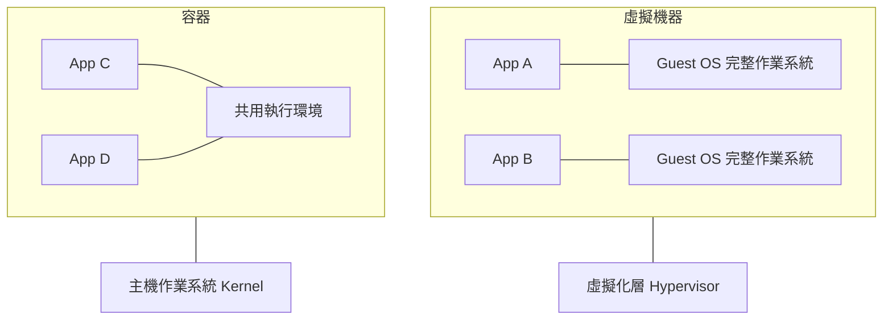

# 1.1 為什麼需要 Docker？

## 從一個問題開始

「在我電腦上可以執行啊！」——這大概是軟體工程史上最經典的藉口。你寫了一個程式，在本機跑得好好的，交給同事或部署到伺服器上就掛了：Python 版本不同、套件裝不起來、環境變數沒設、作業系統行為不一樣。

問題的根源是：**程式不只包含你的程式碼，還包含它所依賴的整個環境。** 程式碼可以用 Git 傳遞，但「環境」過去很難打包傳遞。

## Docker 的答案：把環境一起打包

Docker（容器技術）的本質，就是把「應用程式 + 所有依賴 + 執行環境」打包成一個可攜帶的**鏡像（Image）**，這個鏡像在任何裝了 Docker 的機器上執行結果都一樣。

> 打比方：過去搬家的時候，家具要一件一件搬、到了新家還要重新組裝（安裝依賴）；Docker 像是直接把整個房間「原封不動」搬過去，打開就能用。

## Container 與 VM 的根本差異

初學者最常問：「Docker 不是虛擬機嗎？」不是。兩者隔離的層級完全不同：

| | 虛擬機器（VM） | 容器（Container） |
|---|---|---|
| **隔離對象** | 整台機器（含完整的作業系統） | 只隔離應用層，**共用主機核心（kernel）** |
| **大小** | 通常數 GB 到數十 GB | 通常數十 MB 到數百 MB |
| **啟動速度** | 數十秒到數分鐘 | **不到一秒** |
| **資源開銷** | 高（每台 VM 都要完整 OS） | 低（一台機器可跑數十個容器） |
| **隔離強度** | 較強 | 較弱（但一般開發部署夠用） |

關鍵理解：**VM 虛擬化的是「硬體」，容器虛擬化的是「作業系統的使用者空間」**。容器不是在跑一個完整的 OS，而是用主機的核心，配合鏡像內自帶的檔案系統與依賴。這就是它又快又輕的原因。

## 容器解決了什麼工程問題

- **環境一致性**：開發、測試、正式環境跑同一個鏡像，消滅「在我電腦上可以執行」
- **快速部署**：鏡像建構一次，處處執行，啟動只要一秒
- **資源隔離**：多個專案用不同版本的依賴互不衝突（一台機器同時跑 Python 3.9 和 3.12）
- **易於清理**：刪除容器不留痕跡，不會把主機環境弄得一團亂

## 本章小結

- 程式的依賴環境難以傳遞，是「在我電腦上可以執行」的根源
- **Docker 把程式與環境打包成鏡像**，在任何機器上執行結果一致
- **VM 虛擬化硬體，容器共用主機核心**，因此容器又快又輕
- 容器解決環境一致性、部署速度、資源隔離三大工程問題

## 想一想

1. 你曾經遇過哪些「環境不一樣」造成的問題？容器如何解決？
2. 為什麼容器比 VM 輕量？關鍵在哪一層的差異？
3. 什麼情況下你應該用 VM 而不是容器？（提示：需要不同作業系統核心時）
