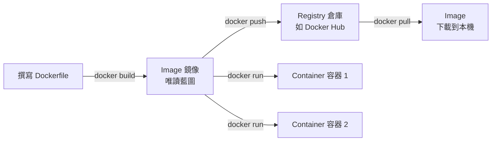

# 1.2 Docker 核心三大元件

## 用一個比方理解一切

學 Docker 的所有概念，都可以從一個比方出發：**物件導向程式設計**。

- **Image（鏡像）**：像「類別（class）」——是一份唯讀的藍圖與範本
- **Container（容器）**：像「物件（instance）」——藍圖執行起來的實體
- **Registry（倉庫）**：像「套件管理伺服器（如 Maven Central、npm）」——存放與分享鏡像的地方

一個 Image 可以啟動多個 Container，就像一個 class 可以 new 出多個 instance。

## Image（鏡像）：應用程式的藍圖

Image 是一個**唯讀**的打包檔案，內含：

- 應用程式的程式碼與執行檔
- 所有依賴（套件、函式庫）
- 基礎作業系統的檔案系統（如精簡版的 Linux）
- 啟動指令與預設設定

Image 採用**分層架構（Layer）**：每一條 Dockerfile 指令產生一層，層與層之間可以共用與快取。這個設計讓「下載」和「建構」都很快——相同的層不必重複下載。

Image 的命名格式：`名稱:標籤`，例如 `nginx:latest`、`python:3.12-slim`。不寫標籤時預設是 `latest`。

## Container（容器）：跑起來的實體

Container 是 Image 的**執行實體**。啟動時，Docker 會在唯讀的 Image 層之上加一層**可寫層（writable layer）**：

- 容器執行期間的所有修改（寫檔案、裝套件）都寫在可寫層
- **刪除容器，可寫層就消失**——這就是「容器內的資料不持久化」的原因（見第四章）
- Image 本身永遠不被修改，所以一個 Image 可以乾淨地啟動多個容器

| | Image | Container |
|---|---|---|
| **性質** | 唯讀、靜態 | 可寫、執行中 |
| **存在方式** | 存在本地或倉庫 | 存在主機上執行 |
| **生命週期** | 直到被刪除（`docker rmi`） | 停止後仍存在，直到被刪除（`docker rm`） |
| **數量關係** | 一個 | 由同一個 Image 可啟動多個 |

## Registry（倉庫）：存放與分享 Image

Registry 是存放 Image 的伺服器，最常用的是公開的 **Docker Hub**（hub.docker.com），也有公司自建的私有倉庫（如 GitHub Container Registry、AWS ECR）。

- **`docker pull`**：從倉庫下載 Image 到本地
- **`docker push`**：把本地 Image 推上倉庫
- **`docker run`** 的智慧行為：本地沒有這個 Image 時，**會自動從倉庫下載**再執行

這就是為什麼 `docker run nginx` 一行指令就能啟動一個網頁伺服器——Docker 背後自動完成了 pull 的動作。

## 本章小結

- **Image 是唯讀藍圖，Container 是執行實體，Registry 是存放分享的地方**
- 一個 Image 可啟動多個 Container（像 class 與 instance）
- Image 採**分層架構**，層可共用與快取
- 容器修改寫在**可寫層**，刪除容器資料就消失
- `docker run` 在本地沒有 Image 時會**自動 pull**

## 想一想

1. 用「class 與 instance」的比方，解釋為什麼一個 nginx Image 可以同時跑多個容器？
2. 為什麼在容器內安裝的套件，重啟容器後還在，但刪除容器重建後就不見了？
3. 分層架構對「團隊分享 Image」有什麼好處？
