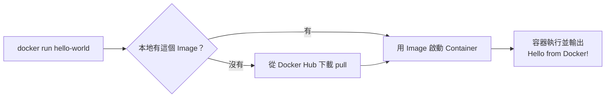

# 1.3 5 分鐘快速安裝

## 各平台的安裝方式

### macOS / Windows：Docker Desktop

最簡單的方式是安裝 **Docker Desktop**，它是一個包含 Docker 引擎、CLI 與圖形介面的整合套件：

1. 前往 https://www.docker.com/products/docker-desktop/ 下載
2. macOS：下載對應晶片的版本（Apple Silicon 選 Apple Chip；Intel 選 Intel Chip），拖進 Applications 後啟動
3. Windows：需要 Windows 10/11（建議啟用 WSL2，安裝程式通常會自動協助設定）
4. 啟動後，選單列／系統列出現鯨魚圖示即表示執行中

> 注意：Docker Desktop 對大型公司（員工 250 人以上或年營收 1000 萬美元以上）需要付費授權；個人、教育、小型公司免費。

### Linux：直接安裝引擎

Linux 不需要 Desktop 版，直接安裝 Docker Engine（以 Ubuntu 為例）：

```bash
# 官方安裝腳本（最省事）
curl -fsSL https://get.docker.com | sh

# 讓目前使用者不需要 sudo 就能執行 docker（執行後要登出重登）
sudo usermod -aG docker $USER
```

## 驗證安裝

安裝完後，打開終端機執行：

```bash
docker --version
# Docker version 27.x.x, build xxxxx

docker run hello-world
```

`docker run hello-world` 會做以下幾件事——這正好複習 1.2 節的三大元件：



如果你看到 `Hello from Docker!` 的訊息，恭喜——Docker 的三大元件（pull、image、container）已經在你機器上完整跑過一輪了。

## 常見問題排解

| 問題 | 解法 |
|---|---|
| macOS：`Cannot connect to the Docker daemon` | 確認 Docker Desktop 已啟動（鯨魚圖示） |
| Linux：每次都要 `sudo` | 執行 `sudo usermod -aG docker $USER` 後重新登入 |
| Windows：WSL2 相關錯誤 | 確認已啟用 WSL2：`wsl --update` |
| 下載 Image 很慢 | 可設定鏡像源（registry mirror），或檢查網路／代理 |

## 本章小結

- macOS/Windows 用 **Docker Desktop**，Linux 直接裝 **Docker Engine**
- 驗證安裝：`docker run hello-world`
- 這一行指令背後包含：自動 pull → 用 Image 啟動 Container → 輸出結果
- Linux 下記得把使用者加入 `docker` 群組，免得每次都要 `sudo`

## 想一想

1. `docker run hello-world` 背後發生了哪些事？對應到哪三大元件？
2. 為什麼 Linux 使用者加入 docker 群組之後可以不用 sudo？（提示：docker daemon 是以 root 執行的，這也是安全性的考量點）
