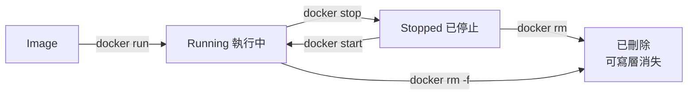

# 2.1 容器生命週期控制

## 一個容器的生與死

容器有明確的生命週期：**建立 → 執行 → 停止 → 刪除**。掌握本節的幾個指令，就能完全掌控容器的生與死。



## 啟動與執行：`docker run`

`docker run` 是最核心的指令，本地沒有 Image 時會自動 pull：

```bash
# 基本執行（前景）：輸出直接印在終端機，按 Ctrl+C 停止
docker run hello-world

# 背景執行（-d = detached）：容器在背景跑，回傳容器 ID
docker run -d nginx

# 常用組合：背景執行 + 埠對映 + 指定名稱
docker run -d -p 8080:80 --name my-nginx nginx
```

| 選項 | 意義 |
|---|---|
| `-d` | 背景執行（detached），終端機可以繼續做事 |
| `--name` | 給容器取名字，之後不用記容器 ID |
| `--rm` | 容器停止後**自動刪除**（適合一次性任務） |
| `-p 8080:80` | 埠對映（下一節詳述） |
| `-e KEY=value` | 設定環境變數 |

> 初學者常見困惑：`docker run nginx` 沒加 `-d` 時「卡住了」。其實不是卡住，是 Nginx 在前景執行、輸出印在你的終端機上。按 `Ctrl+C` 會停止容器。**伺服器類程式幾乎都要加 `-d`。**

## 查看狀態：`docker ps`

```bash
# 只顯示執行中的容器
docker ps

# 顯示所有容器（含已停止的）——最常用的排查指令
docker ps -a
```

輸出欄位的重點：

- **CONTAINER ID**：容器唯一 ID（短版），操作時通常寫前幾碼就夠
- **STATUS**：`Up 5 minutes`（執行中）或 `Exited (0) 2 minutes ago`（已停止，0 表示正常結束）
- **NAMES**：容器名稱，沒指定時 Docker 會隨機取一個有趣的名字（如 `angry_beaver`）

## 停止、啟動與刪除

```bash
docker stop my-nginx     # 優雅停止（先送 SIGTERM，10 秒後強制）
docker start my-nginx    # 重新啟動已停止的容器（設定保留）
docker restart my-nginx  # 重啟執行中的容器

docker rm my-nginx       # 刪除容器（必須是停止狀態）
docker rm -f my-nginx    # 強制刪除（連執行中的也刪）
```

重要觀念（複習 1.2 節）：

- **`docker stop` 只是停止執行，容器還在**，`docker start` 可以恢復，所有設定保留
- **`docker rm` 才是真的刪除**，容器內的資料（可寫層）隨之消失
- Image 不受影響——刪除容器後還可以再用同一個 Image 啟動新容器

## 一次性任務的慣用法

跑完就丟的任務（測試、腳本、臨時工具），加上 `--rm` 讓 Docker 自動清理：

```bash
# 用 Python 3.12 執行一段程式碼，結束後容器自動刪除
docker run --rm python:3.12 python -c "print('hello')"

# 臨時進入一個 Alpine Linux 玩一玩
docker run --rm -it alpine sh
```

這是容器比傳統安裝乾淨的關鍵：**用完即丟，不留痕跡**。

## 本章小結

- 生命週期：**建立 → 執行 → 停止 → 刪除**
- `docker run`：啟動；`-d` 背景執行、`--name` 命名、`--rm` 用完即刪
- `docker ps` 看執行中，**`docker ps -a` 看全部**（排查必用）
- `stop` 停止但容器還在，**`rm` 才是真的刪除**（資料消失）
- 一次性任務：`docker run --rm -it <image> <command>`

## 想一想

1. `docker run nginx` 沒加 `-d` 時終端機「卡住」，實際上發生了什麼事？
2. `docker stop` 之後再 `docker start`，容器內你手動改過的檔案還在嗎？為什麼？
3. 為什麼一次性任務建議加 `--rm`？如果不加，會累積什麼問題？
