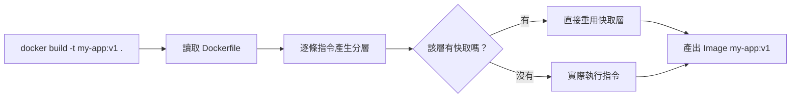

# 3.2 建構與標籤

## 打包你的第一個 Image：`docker build`

寫好 Dockerfile 後，在**Dockerfile 所在目錄**執行：

```bash
docker build -t my-app:v1 .
```

拆解這行指令：

| 部分 | 意義 |
|---|---|
| `-t my-app:v1` | 給 Image 命名（`名稱:標籤`），不寫標籤預設 `latest` |
| `.`（最後那個點） | **建構上下文（build context）**——把當前目錄的內容交給 Docker |



建構過程會逐行顯示每條指令的執行結果，最後出現：

```
Successfully built abc123def456
Successfully tagged my-app:v1
```

## 查看與管理本地 Image

```bash
docker images          # 列出本地所有 Image
docker rmi my-app:v1   # 刪除某個 Image（rmi = remove image）
```

`docker images` 的重點欄位：

- **REPOSITORY:TAG**：名稱與標籤
- **SIZE**：大小——這是優化 Dockerfile 的成績單（見 3.3 節）
- **CREATED**：多久之前建構的

同一個 Image 可以有多個標籤（用 `docker tag my-app:v1 my-app:latest` 追加），刪掉一個標籤不代表刪掉 Image 本身。

## 執行自己打造的 Image

```bash
docker run -d -p 8000:8000 --name app1 my-app:v1
docker logs -f app1     # 看你的程式跑起來沒
curl http://localhost:8000
```

流程與第二章完全相同——只是 Image 換成自己的。**這就是 Docker 的威力：不論程式是誰寫的、用什麼語言，操作方式都一模一樣。**

## 標籤（tag）的工程意義

標籤不只是名字，它是**版本管理**的基礎：

- `my-app:v1`、`my-app:v2`：明確版本，正式部署用
- `my-app:latest`：最新的，方便但**不可靠**（今天和明天的 latest 可能不同）
- 部署到正式環境時，**永遠用明確版本標籤**，避免「重新部署後行為變了」的詭異問題

## 本章小結

- **`docker build -t 名稱:標籤 .`**：那個點是建構上下文，別忘了
- `docker images` 查看、`docker rmi` 刪除
- Image 的 SIZE 是優化成績單
- **正式部署用明確版本標籤**，不要依賴 `latest`
- 自己的 Image 操作方式與現成 Image 完全相同

## 想一想

1. `docker build` 最後的 `.` 代表什麼？漏掉會發生什麼？
2. 為什麼 `latest` 標籤不可靠？它可能造成什麼部署問題？
3. 同一個 Image 有兩個標籤，`docker rmi` 掉其中一個，Image 真的被刪了嗎？
