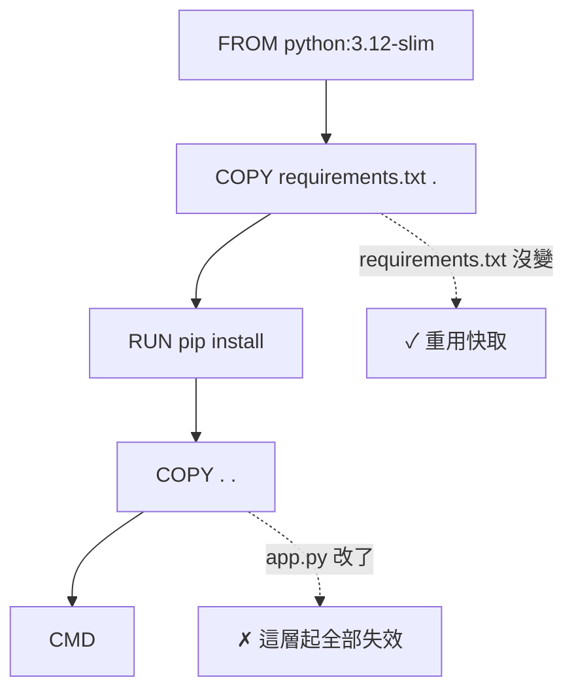

# 3.3 Dockerfile 極簡優化技巧

## 為什麼要優化 Dockerfile？

兩個動機：

1. **快**：每次改程式碼都要重新 build。指令順序安排得好，改一行程式碼只 rebuild 一小部分（幾秒）；安排得不好，每次都裝全部依賴（幾分鐘）。
2. **小**：Image 越小，下載、部署、啟動越快，安全漏洞面也越小。

核心觀念只有一個：**理解 Docker 的層快取機制，一切優化都從它出發。**

## 快取機制：一層一層比對

Docker 建構時，會從頭逐條指令比對快取：

- 指令內容沒變、且**之前的層都沒變** → 直接重用快取層
- 某一層失效了 → **它之後的所有層全部失效**，重新執行



## 技巧一：把最不常變的放前面

Dockerfile 的指令順序，應該按「**變動頻率由低到高**」排列：

```dockerfile
# 好：依賴檔案先複製、先安裝（最不常變）
FROM python:3.12-slim
WORKDIR /app
COPY requirements.txt .
RUN pip install -r requirements.txt
COPY . .                    # 程式碼（常變）放最後
CMD ["python", "app.py"]
```

```dockerfile
# 壞：程式碼先複製，改任何一行都要重裝全部依賴
FROM python:3.12-slim
WORKDIR /app
COPY . .                    # ← 改一行 app.py，這層就失效
RUN pip install -r requirements.txt   # ← 於是每次都重跑，幾分鐘
CMD ["python", "app.py"]
```

**這是所有 Dockerfile 優化中投資報酬率最高的一招。**

## 技巧二：`.dockerignore` 排除不必要的檔案

建構上下文（`docker build .` 的那個點）會把目錄內**所有**檔案交給 Docker——包括 `.git`、`node_modules`、日誌、暫存檔。在 Dockerfile 同目錄建立 `.dockerignore`（語法與 `.gitignore` 相同）：

```
.git
.gitignore
node_modules
__pycache__
*.log
.env
Dockerfile
.dockerignore
```

好處：建構更快、Image 更小，而且**避免把機密（`.env`）打包進 Image**——這是安全底線。

## 技巧三：合併 RUN、清理快取

每條 `RUN` 產生一層，層內的檔案刪了也不會讓 Image 變小（刪除動作只是記在新層）。所以要**在同一條 RUN 內完成「安裝 + 清理」**：

```dockerfile
# 壞：apt 快取留在層裡
RUN apt-get update && apt-get install -y curl

# 好：同一層內清理
RUN apt-get update && apt-get install -y curl \
    && rm -rf /var/lib/apt/lists/*
```

## 技巧四：選小的基礎 Image

- `python:3.12`（約 1GB）→ `python:3.12-slim`（約 150MB）→ `python:3.12-alpine`（約 50MB）
- 編譯型語言（Go、Rust）可用**多階段建構**（見 3.1 節 Go 範例）：編譯層用大鏡像，最終層只放執行檔

## 檢驗成果

```bash
docker build -t my-app:v2 .
docker images my-app        # 比較 v1 與 v2 的 SIZE
```

再改一行程式碼重新 build，觀察 log 中 `CACHED` 字樣的數量——**快取命中越多，優化越成功。**

## 本章小結

- 一切優化都源於**層快取機制**：某層失效，之後全部失效
- **指令按變動頻率由低到高排列**（依賴先、程式碼後）——報酬率最高的一招
- **`.dockerignore`** 排除 `.git`、`node_modules`、`.env`（兼顧速度與安全）
- **合併 RUN、同層清理**，刪除不會縮小已成的層
- 選 `-slim`/`alpine` 底層，編譯型語言用多階段建構

## 想一想

1. 為什麼「先 COPY 程式碼、再 RUN pip install」會讓每次 build 都重裝依賴？
2. 在某一層 `RUN rm -rf /big-file`，Image 會變小嗎？為什麼？
3. 為什麼 `.env` 一定要放進 `.dockerignore`？如果被打包進 Image 會有什麼風險？
