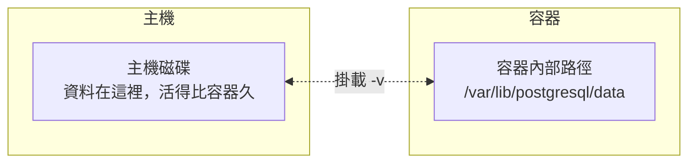

# 4.1 資料持久化：容器毀滅資料還在

## 一個危險的事實

複習 1.2 節：容器的修改寫在**可寫層**，**刪除容器（`docker rm`），可寫層就消失**。

用 PostgreSQL 來看這件事有多危險：

```bash
docker run -d -p 5432:5432 --name db -e POSTGRES_PASSWORD=x postgres
# ……使用一段時間，資料庫裡累積了重要資料……
docker rm db              # 刪除容器
docker run -d -p 5432:5432 --name db -e POSTGRES_PASSWORD=x postgres
# 資料全沒了。
```

**容器天生是「用完即丟」的設計，但資料需要活得比容器久。** 解法就是**掛載（Mount）**：把主機上的某個位置「借給」容器存資料，容器刪了，主機上的資料還在。



## 方式一：Bind Mounts（掛載本地目錄）

直接把主機的某個目錄映射進容器，語法與 `-p` 類似：

```bash
docker run -d -p 5432:5432 --name db \
  -v /Users/me/pgdata:/var/lib/postgresql/data \
  -e POSTGRES_PASSWORD=mysecret \
  postgres
```

語法：`-v <主機路徑>:<容器路徑>`。容器把資料寫進 `/var/lib/postgresql/data` 時，實際寫在主機的 `/Users/me/pgdata`。

**Bind Mounts 最經典的用途：開發時的熱重載**——把程式碼目錄掛進容器，改主機上的檔案，容器內立即生效：

```bash
docker run --rm -p 8000:8000 \
  -v $(pwd):/app \
  -w /app \
  python:3.12 python app.py
# 改主機上的 app.py，重新請求即看到新結果（搭配自動重載工具）
```

## 方式二：Docker Volumes（容器專用磁區）

Docker 管理的專用儲存區（存在 Docker 自己的目錄下，主機使用者不必管路徑）：

```bash
# 建立與查看 volume
docker volume create pgdata
docker volume ls

# 使用：只寫 volume 名稱，不寫主機路徑
docker run -d -p 5432:5432 --name db \
  -v pgdata:/var/lib/postgresql/data \
  -e POSTGRES_PASSWORD=mysecret \
  postgres

# 刪除
docker volume rm pgdata
```

## Bind Mounts 與 Volumes 怎麼選？

| | Bind Mounts | Docker Volumes |
|---|---|---|
| **路徑由誰管理** | 你自己指定 | Docker 管理 |
| **適合場景** | 開發時掛程式碼（要改檔案） | 存放資料庫、正式環境資料 |
| **可攜性** | 依賴主機路徑（macOS/Windows 路徑不同） | 跨平台、可由 volume 驅動支援 |
| **效能** | macOS/Windows 上較慢（檔案系統轉譯） | 較好 |

> 實務慣用法：**開發掛程式碼用 Bind Mounts，存資料庫資料用 Volumes**。這樣記就對了。

## 驗證持久化

親手驗證一次，印象最深刻：

```bash
docker run --rm -v pgdata:/data alpine sh -c "echo hello > /data/a.txt"
docker run --rm -v pgdata:/data alpine cat /data/a.txt    # hello
```

兩個容器（甚至都已刪除）透過同一個 volume 共享資料——**資料屬於 volume，不屬於任何容器。**

## 本章小結

- **刪除容器，容器內資料就消失**——容器天生用完即丟
- **掛載**讓資料活得比容器久：`-v 主機路徑:容器路徑`
- **Bind Mounts**：掛本地目錄，適合開發熱重載
- **Volumes**：Docker 管理的專用磁區，適合資料庫與正式環境
- 慣用法：**開發用 Bind Mounts，存資料用 Volumes**

## 想一想

1. 為什麼「刪除容器資料就消失」？對應到 1.2 節的哪個機制？
2. 開發時想「改主機上的程式碼、容器內立即生效」，該用哪種掛載？
3. 為什麼正式環境的資料庫建議用 Volumes 而不是 Bind Mounts？
