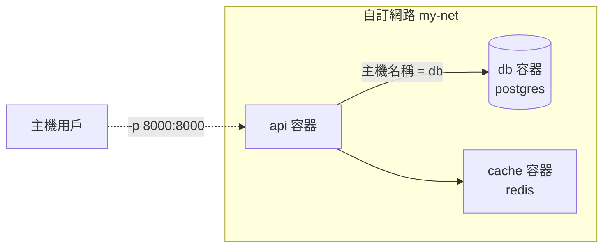

# 4.2 容器間的通訊網路

## 一個常見的困境

你用容器跑了一個後端和一個資料庫，後端要連資料庫。第一個直覺是「用 2.3 節的埠對映，連 `localhost:5432`」——但在容器內，`localhost` 指的是**容器自己**，不是主機。這條路不通（或不乾淨）。

正確的解法是 **Docker 網路**：把多個容器放進同一個自訂網路，它們就能**用容器名稱互相訪問**。

## 兩種網路的區別

### 預設 bridge 網路

不特別設定時，所有容器都在 Docker 的預設 `bridge` 網路——但**預設網路上容器之間不能用名稱互訪**，只能靠 IP（IP 會變，不可靠）。

### 自訂網路（建議）

自建的網路自帶 **DNS 服務**：容器名稱就是主機名稱，直接可連。

```bash
# 建立自訂網路
docker network create my-net

# 把後端與資料庫放進同一個網路
docker run -d --name db --network my-net \
  -v pgdata:/var/lib/postgresql/data \
  -e POSTGRES_PASSWORD=mysecret \
  postgres

docker run -d --name api --network my-net -p 8000:8000 my-app:v1
```

之後在 `api` 容器內，連線字串直接寫**容器名稱**：

```bash
# 在 api 容器內（或其他同網路容器內）：
psql -h db -U postgres     # ← host 就寫 db，不用 IP、不用 localhost
```



**容器間通訊不佔用主機埠**——只有需要被外部（瀏覽器、使用者）訪問的容器才需要 `-p`。資料庫不該暴露給外部，所以不給它 `-p`，這同時也是安全設計。

## 網路管理常用指令

```bash
docker network create my-net   # 建立
docker network ls              # 列出
docker network inspect my-net  # 看網路內有哪些容器
docker network connect my-net web   # 把執行中的容器加入網路
docker network rm my-net       # 刪除
```

## 實戰：後端 + Redis + PostgreSQL

```bash
docker network create app-net

docker run -d --name cache --network app-net redis
docker run -d --name db --network app-net \
  -v pgdata:/var/lib/postgresql/data \
  -e POSTGRES_PASSWORD=mysecret postgres
docker run -d --name api --network app-net -p 8000:8000 my-app:v1
```

連線設定的工程意義：

- `api` → 資料庫：`host=db, port=5432`
- `api` → Redis：`host=cache, port=6379`
- 這些主機名稱在任何環境都一樣——**開發、測試、正式環境的設定可以完全一致**

## 本章小結

- 容器內的 `localhost` 是容器自己，不是主機
- **自訂網路自帶 DNS：容器名稱就是主機名稱**——`docker network create`
- **只有需要外部訪問的容器才加 `-p`**；資料庫不暴露，更安全
- 容器間通訊不佔主機埠
- 用容器名稱連線，各環境設定一致

## 想一想

1. 為什麼在容器內連 `localhost:5432` 連不到另一個容器裡的資料庫？
2. 為什麼資料庫容器「不該」加 `-p 5432:5432`？什麼情況下才需要？
3. 「用容器名稱當主機名稱」對多環境部署有什麼好處？
