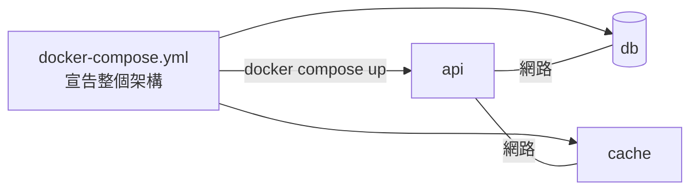

# 5.1 為什麼需要 Docker Compose？

## 從一長串指令到一份 YAML

到第四章為止，跑一個「後端 + 資料庫 + Redis」的架構，需要三行 `docker run`，每行帶著一長串選項：

```bash
docker network create app-net
docker run -d --name cache --network app-net redis
docker run -d --name db --network app-net \
  -v pgdata:/var/lib/postgresql/data \
  -e POSTGRES_PASSWORD=mysecret postgres
docker run -d --name api --network app-net -p 8000:8000 my-app:v1
```

問題立刻浮現：

- **指令太長太容易錯**，也沒有人記得住
- **環境無法分享**：同事要跑同樣的架構，只能複製貼上你的指令
- **管理分散**：啟動、停止、更新要對每個容器分別操作
- **順序要自己顧**：資料庫要等它起來，後端才能連

**Docker Compose** 的答案：用一份 `docker-compose.yml` 檔，把**整個架構（網路、容器、掛載、環境變數、相依順序）**宣告出來，然後一行指令啟動全部。

> 打比方：`docker run` 是一條一條下指令操作每個樂器，Compose 是一份**樂譜**——把所有樂器的進場時間、音量都寫好，指揮棒一舉（`docker compose up`），整個樂團一起演奏。



## Compose 解決了什麼

| 痛點 | Compose 的解法 |
|---|---|
| 指令太長 | 全部寫進 YAML，可版本控制（進 Git） |
| 環境無法分享 | 同事 clone 專案後 `docker compose up` 即可 |
| 管理分散 | 一行指令操作**整組服務**（up / down / logs） |
| 順序問題 | `depends_on` 宣告相依關係 |
| 網路要自己建 | **Compose 自動建立網路**，服務名稱即可互訪（複習 4.2 節） |

## 版本控制與架構即程式碼

`docker-compose.yml` 放在專案根目錄、進 Git，這是 **「基礎架構即程式碼（Infrastructure as Code）」** 思想的入門實踐：

- 架構的「真相」有一份、在版本控制中，不存於某人的腦袋或筆記
- 改架構 = 改檔案 = Git commit，有紀錄、可回溯、可審查
- 團隊每個人的開發環境**完全一致**

## 本章小結

- 多個容器用一長串 `docker run` 管理，又長又難分享
- **Compose 用一份 YAML 宣告整個架構**，一行指令啟動全部
- 自動建立網路，**服務名稱即可互訪**
- YAML 進 Git，是**架構即程式碼**思想的入門

## 想一想

1. 你目前的專案需要幾行 `docker run`？寫成 Compose 會長怎樣？
2. 「架構即程式碼」和「架構存在某人的筆記裡」差在哪裡？
3. 為什麼 Compose 能讓團隊每個人的開發環境完全一致？
