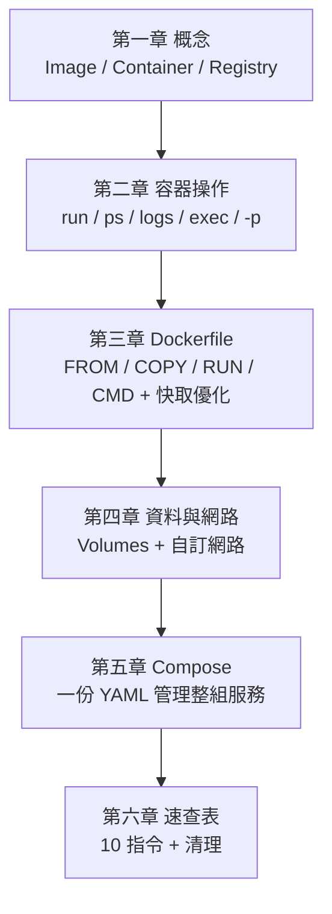

# 6.2 系統清理大掃除

## Docker 吃磁碟空間的三個元凶

用 Docker 一陣子之後，磁碟空間悄悄被吃掉——元凶有三：

- **停止的容器**：`docker run` 過的容器（含可寫層）即使停止也佔空間
- **懸空 Image**：重新 build 之後，舊的 Image 層變成沒有標籤的 `<none>` 殘骸
- **沒人用的 volume 與網路**：實驗過程留下來的

```bash
docker system df        # 先看 Docker 到底吃了多少空間
```

輸出會顯示 Images、Containers、Volumes 各佔多少——**清理前先診斷，這是好習慣。**

## 等級一：溫和清理（放心執行）

```bash
docker system prune
```

刪除：停止的容器、懸空（無標籤）Image、沒人用的網路、建構快取。
**不會刪**：有標籤的 Image、有標籤的 volume——資料安全。

## 等級二：深度清理（注意 Image）

```bash
docker system prune -a
```

多了 `-a`（all）：連**所有沒有容器在使用的 Image** 也刪掉。下次 `docker run` 或 `build` 時要重新下載／建構。適合「要大掃除」的場合，代價是之後第一次啟動比較慢。

## 等級三：連 volume 一起刪（慎用）

```bash
docker system prune -a --volumes
```

**連資料庫的 volume 也會刪**——如果你有跑 PostgreSQL/MySQL，資料會直接消失。除非你非常確定資料不要了，否則不要用這一等級。

## 個別資源的清理指令

| 資源 | 指令 | 說明 |
|---|---|---|
| 停止的容器 | `docker container prune` | 只清容器 |
| 懸空 Image | `docker image prune` | 加 `-a` 清所有未使用的 |
| volume | `docker volume prune` | 加 `-f` 跳過確認 |
| 網路 | `docker network prune` | 只清網路 |
| 建構快取 | `docker builder prune` | 建構慢？清快取後要重新累積 |

## 清理的判斷準則

- **日常**：`docker system prune`，溫和無痛，可以養成習慣每週跑一次
- **大掃除**：`docker system prune -a`，Image 會重下，可接受
- **資料**：任何 prune 都先想一下——**volume 裡有沒有活著的資料？**
- 一次性任務平常就加 `--rm`，就不會累積停止的容器（複習 2.1 節）

## 本章小結

- 先用 **`docker system df`** 診斷，再決定清理等級
- **`docker system prune`**：溫和，不動有標籤的 Image 與 volume
- **`prune -a`**：連未使用的 Image 也刪，下次要重下
- **`prune -a --volumes`**：連資料一起刪，**慎用**
- 平常養成 `--rm` 的習慣，就不需要常常大掃除

## 想一想

1. 三個清理等級各刪什麼、各留什麼？哪一個會讓資料庫資料消失？
2. 為什麼 build 幾次之後會出現 `<none>` 的懸空 Image？
3. 為你自己的使用情境，設計一個清理習慣（多久跑一次、用哪個等級）？

---

## 全書總結：Docker 極最小知識地圖



- **三大元件**：Image 是藍圖、Container 是實體、Registry 是倉庫
- **容器操作**：run、ps、logs、exec、rm，加上 `-p` 埠對映
- **Dockerfile**：六條核心指令，快取優化按「變動頻率由低到高」排列
- **持久化與網路**：資料用 volume 活得比容器久，容器間用名稱互訪
- **Compose**：一份 YAML、一行指令，管理整組服務
- **日常**：10 個指令 + 排障三部曲 + 定期溫和清理

你已經掌握了 Docker 的最小可行知識。剩下的 20%（多階段建構、Swarm/Kubernetes、CI/CD 整合、安全掃描），等實務需要時再學也不遲。
