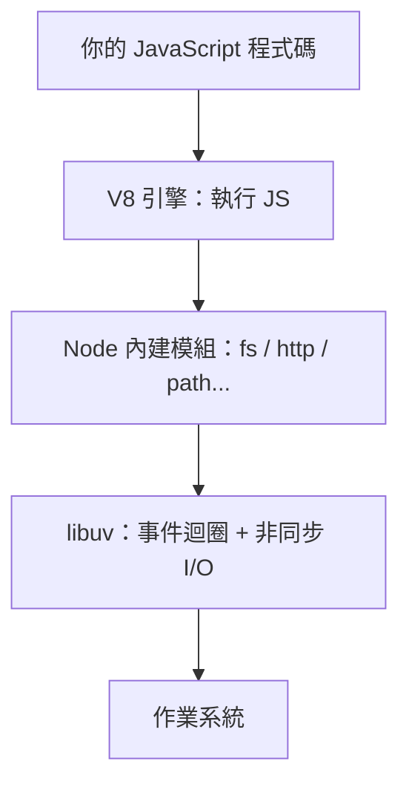

# 1.1 為什麼需要 Node.js？

## 從一個問題開始

JavaScript 誕生時只能跑在瀏覽器裡，負責讓網頁動起來。但伺服器端長期由 Java、Python、PHP 等語言把持。工程師得學兩種語言：前端一套、後端一套。

2009 年，Node.js 出現，把 JavaScript 帶出了瀏覽器。

## Node.js 的本質：V8 引擎 + 事件迴圈

**Node.js 不是程式語言，是一個 JavaScript 的執行環境（runtime）**，由兩個核心組成：

| 組件 | 來源 | 用途 |
|---|---|---|
| V8 引擎 | Google Chrome | 把 JavaScript 編譯成機器碼並執行 |
| libuv | Node.js 專案 | 提供**事件迴圈（Event Loop）**與非同步 I/O |

## Node.js 的殺手級特色：非同步 I/O

傳統伺服器處理請求的方式是「一個請求擋住一個執行緒」，等資料庫回應的時間都在空轉。

Node.js 的做法：**單一執行緒 + 事件迴圈**。遇到 I/O（讀檔、查資料庫、網路請求）時不等它，先登記一個「完成後要做的回呼」，繼續處理下一個請求。I/O 完成時事件迴圈再回頭執行回呼。

結果：**一個 Node.js 程序可以輕鬆撐起上萬個同時連線**，特別適合 I/O 密集的 Web 服務與 API。

> 打比方：餐廳服務生點完餐不站在廚房等菜出來，而是先去服務下一桌；菜好了鈴響再回來端。傳統模式則是每桌配一個服務生全程站著等。

## Node.js vs 瀏覽器：同一種語言，不同環境

| | 瀏覽器 | Node.js |
|---|---|---|
| 全域物件 | `window` | `global`、`process` |
| 讀檔案 | 不行 | `fs` 模組 |
| 模組系統 | ESM | CommonJS + ESM |
| 用途 | 網頁互動 | 後端 API、CLI 工具、建置腳本 |

「前後端同一種語言」帶來的好處：

1. **一種語言通吃**：前端工程師能直接寫後端
2. **程式碼共用**：驗證邏輯、資料結構前後端共用
3. **龐大生態系**：npm 是世界上最大的套件庫

> Node.js 的典型應用：Web API 伺服器、CLI 工具（如 eslint、webpack 都是 Node 程式）、前端專案的建置環境、Serverless 函式。
