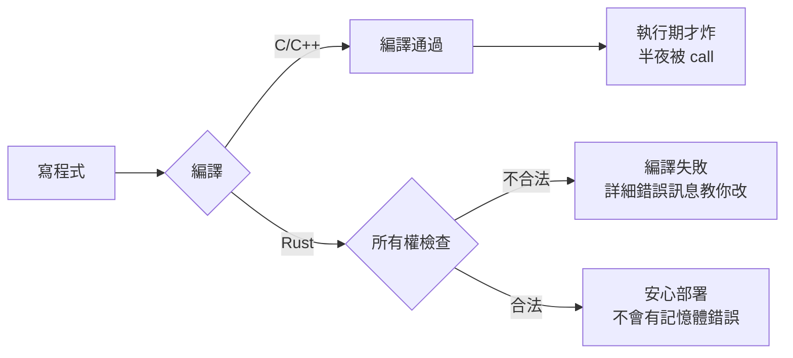

# 1.1 為什麼需要 Rust？

## 從一個問題開始

你寫了一個 C/C++ 程式，跑得很快，但半夜被 call 起來：記憶體用完了、程式在某個奇怪的地方當機了、有人改了別人的程式碼之後你的資料被意外改掉。這些都是**記憶體安全**與**資料競爭**的經典問題。

另一邊，你寫了一個 Python/JavaScript 程式，開發很快，但部署到正式環境發現：太慢了、記憶體吃太多、無法承載尖峰流量。

**Rust 的答案：同時做到「C 級的效能」與「不用煩惱記憶體管理的安全性」**——而且這兩件事不是靠執行時期的垃圾回收（GC），而是靠**編譯期的所有權檢查**。

## 三種語言世代的取捨

| | C / C++ | Go / Java / Python | Rust |
|---|---|---|---|
| **效能** | 最快 | 中等（有 GC 或直譯開銷） | **接近 C** |
| **記憶體管理** | 手動（容易出錯） | 垃圾回收（GC） | **所有權系統（編譯期檢查）** |
| **記憶體安全** | ✗ 容易出錯 | ✓（GC 保證） | ✓（無 GC 也保證） |
| **執行時期開銷** | 幾乎沒有 | GC 停頓、直譯 | **幾乎沒有** |
| **學習曲線** | 陡 | 平緩 | **陡（但錯誤在編譯期被抓）** |

## 核心觀念：把錯誤從執行期搬到編譯期

Rust 最深刻的一個洞察：**記憶體錯誤不該在半夜被發現，而該在編譯時被擋下。**

- C/C++ 的空指標、越界存取、use-after-free：執行期才炸，而且炸法千奇百怪
- Rust 的同樣錯誤：**編譯器直接拒絕編譯**，並給出（出名的）詳細錯誤訊息告訴你怎麼改

代價是**學習曲線**：所有權系統（第三章）需要幾週的適應期。但工程上的算盤是：**把除錯時間提前投資到學習期，換取長期的穩定與重構信心。** Rust 社群最常見的說法是「與 Rust 編譯器戰鬥之後，程式幾乎一次就跑對」。

## Rust 適合什麼

- **系統程式**：作業系統、驅動、嵌入式（無 GC、無執行時期）
- **高效能服務**：Web 後端、資料庫、網路基礎設施
- **命令列工具**：啟動快、單一執行檔、跨平台
- **WebAssembly**：Rust 是 Wasm 生態的一等公民
- **重寫關鍵模組**：把其他語言專案中的效能熱點用 Rust 重寫

> 業界實例：Linux 核心正式納入 Rust、Firefox 的核心元件、AWS/Dropbox/Cloudflare 的基礎設施、微軟與 Google 官方鼓勵新系統專案採用 Rust。

## 本章小結

- Rust 同時做到 **C 級效能**與**無 GC 的記憶體安全**
- 靠**編譯期所有權檢查**，把錯誤從執行期搬到編譯期
- 交換條件是**較陡的學習曲線**（第三章詳述）
- 適合系統程式、高效能服務、CLI 工具、Wasm

## 想一想

1. 你曾遇過哪些記憶體或效能問題？Rust 的解法和 C、Python 各有什麼不同？
2. 「把錯誤搬到編譯期」對開發流程有什麼影響？debug 的時間花在哪裡？
3. 你的工作中有什麼場景適合（或不適合）用 Rust？判斷標準是什麼？
