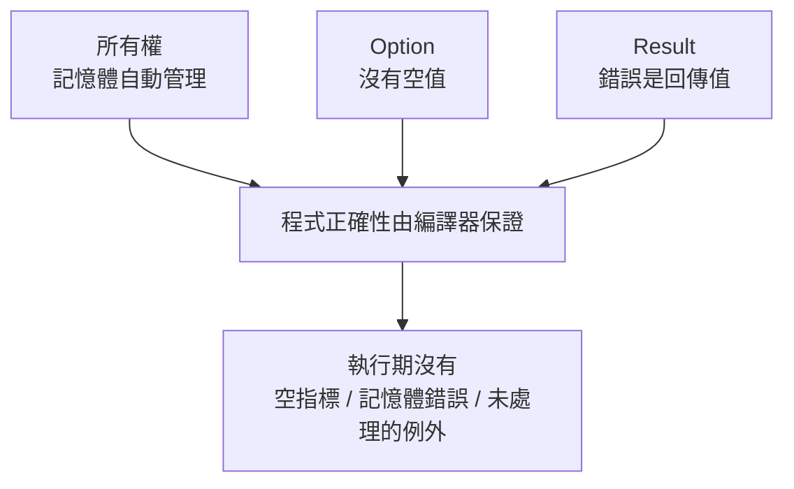

# 1.2 Rust 核心心智模型

## 學 Rust 之前，先建立三個心智模型

Rust 的語法細節很多，但底層只有三個核心觀念。先建立它們，後面的語法都只是這三個觀念的展開：

1. **所有權（Ownership）**：每塊記憶體都有唯一的主人，主人離開作用域，記憶體自動釋放（第三章）
2. **無空值（No null）**：用 `Option<T>` 型別表達「可能沒有值」，編譯器逼你處理
3. **無例外（No exception）**：用 `Result<T, E>` 型別表達「可能失敗」，編譯器逼你處理

## 心智模型一：所有權代替 GC 與手動釋放

傳統兩條路：C/C++ 手動 `malloc`/`free`（容易漏放、重放），Java/Go 靠 GC（執行時期開銷）。Rust 走第三條路：

> 每個值有**唯一的主人**。主人（變數）離開作用域時，值**自動釋放**——像 C++ 的 destructor，但由編譯器**強制保證**只有一個主人，於是「double free」「use-after-free」在語言層面不可能發生。

```rust
fn main() {
    let s = String::from("hello"); // s 擁有這個字串
    takes_ownership(s);            // 所有權「搬走」了，s 之後不能用
    // println!("{}", s);          // ← 編譯錯誤！s 已經沒有所有權
} // s 已被搬走，main 結束不需要釋放

fn takes_ownership(s: String) {
    println!("{}", s);
} // s 離開作用域，記憶體在這裡自動釋放
```

## 心智模型二：`Option<T>` 代替 null

Tony Hoare 稱 null 為「十億美元的錯誤」。Rust 完全沒有 null。「可能沒有值」用型別表達：

```rust
fn find_user(id: u32) -> Option<String> {  // 可能找到，也可能沒有
    // ...
}

fn main() {
    let user = find_user(42);
    println!("{}", user.to_uppercase()); // ← 編譯錯誤！你還沒處理「沒有值」的情況

    match user {
        Some(name) => println!("找到了：{}", name),
        None => println!("查無此人"),
    }
}
```

**型別系統記住了「這可能沒有值」，編譯器逼你在編譯期處理**——null 例外從此不存在於執行期。

## 心智模型三：`Result<T, E>` 代替例外

Rust 沒有 try/catch。「可能失敗」用型別表達，錯誤是**回傳值**，不是控制流：

```rust
use std::fs::File;

fn main() {
    let f = File::open("config.txt");
    match f {
        Ok(file) => println!("開啟成功"),
        Err(e) => println!("失敗：{}", e),   // 編譯器逼你處理失敗
    }
}
```

這三個型別（`Option`、`Result`、以及背後的 enum，見第四章）構成了 Rust 錯誤處理的全部。

## 三個模型合作的結果



> 工程上的意義：Rust 程式碼**重構起來特別安心**——改了型別或搬了程式碼，編譯器會把所有受影響的地方（包括你沒想到的）全部指出來。這是大型專案長期演進最珍貴的特性。

## 本章小結

- 三個心智模型：**所有權、Option（無 null）、Result（無例外）**
- 所有權：每個值唯一主人，離開作用域自動釋放
- 「可能沒有值」與「可能失敗」都用**型別**表達，編譯器逼你處理
- 結果：錯誤在編譯期被抓，重構特別安心

## 想一想

1. 你寫過的語言中，null 和例外造成過什麼問題？Rust 如何在編譯期解決？
2. 「錯誤是回傳值，不是控制流」對程式可讀性有什麼影響？
3. 為什麼「編譯器逼你處理」反而讓開發更快？（提示：除錯時間的轉移）
