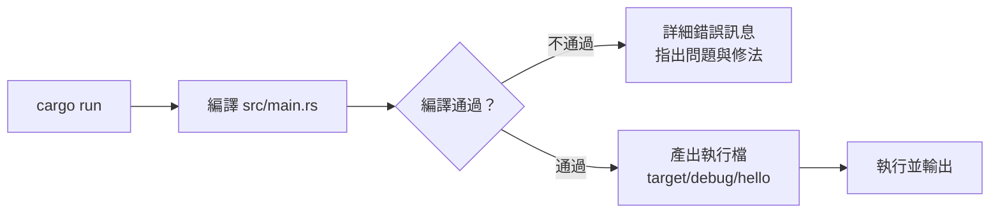

# 1.3 5 分鐘快速安裝與第一個程式

## 安裝：rustup

Rust 官方的安裝與版本管理工具是 **rustup**（類似 nvm、pyenv 的角色）：

```bash
# macOS / Linux / WSL
curl --proto '=https' --tlsv1.2 -sSf https://sh.rustup.rs | sh
```

Windows：到 https://rustup.rs 下載 `rustup-init.exe` 執行（需要 Visual Studio Build Tools 的 C++ 元件，安裝程式會提示）。

安裝完成後重新開啟終端機，驗證：

```bash
rustc --version    # 編譯器版本，如 rustc 1.80.0
cargo --version    # 建構工具版本
```

## 用 Cargo 建立第一個專案

**不要直接用 rustc 編譯單一檔案**——Rust 的日常一律透過 **Cargo**（建構工具 + 套件管理器，見第五章）：

```bash
cargo new hello
cd hello
```

產生的專案結構：

```
hello/
├── Cargo.toml      # 專案設定與依賴（像 package.json）
└── src/
    └── main.rs     # 程式進入點
```

`src/main.rs` 的內容：

```rust
fn main() {
    println!("Hello, world!");
}
```

## 執行

```bash
cargo run
#    Compiling hello v0.1.0
#     Finished dev [unoptimized] target(s)
#     Running `target/debug/hello`
# Hello, world!
```

這一行指令背後發生了什麼——對應 Rust 的工具鏈：



## 版本與更新

```bash
rustup update        # 更新 Rust 到最新穩定版
rustup doc           # 打開離線文件（標準庫、書籍）
```

Rust 採**六週一版**的固定發行節奏，穩定版之間不會破壞相容性——不需要追新版也不會被拋下。

## 常見問題排解

| 問題 | 解法 |
|---|---|
| `cargo: command not found` | 重新開終端機，或 `source $HOME/.cargo/env` |
| Windows 編譯錯誤提到 linker | 安裝 Visual Studio Build Tools（C++ 工作負載） |
| 編譯很慢 | 開發用 `cargo check`（只檢查不產出執行檔，見 5.1 節） |
| 下載依賴很慢 | 檢查網路／代理，或設定 crates.io 鏡像源 |

## 本章小結

- 用 **rustup** 安裝與管理 Rust 版本
- 日常一律透過 **Cargo**：`cargo new` 建專案、`cargo run` 執行
- 專案核心：**`Cargo.toml`（設定與依賴）+ `src/`（程式碼）**
- `rustup update` 更新，`rustup doc` 離線文件

## 想一想

1. `cargo run` 背後做了哪些事？和直接用 rustc 編譯差在哪裡？
2. 「六週一版、不破壞相容」對工程專案有什麼好處？
3. 建一個專案，故意寫錯（例如刪掉分號），觀察 Rust 的錯誤訊息——它有多詳細？
