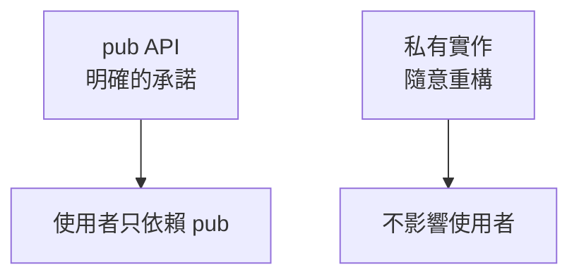

# 4.3 模組與專案組織

## 程式碼大了之後：模組系統

Rust 的模組系統有明確的階層：**crate（套件產物）→ module（模組）→ 項目**。掌握 `mod`、`use`、`pub` 三個關鍵字，就能組織任何規模的專案。

## 模組：`mod` 與 `pub`

```rust
// src/main.rs
mod restaurant;   // 宣告模組：告訴編譯器去找 restaurant.rs

fn main() {
    restaurant::serve_order();
}
```

```rust
// src/restaurant.rs
pub fn serve_order() {              // pub：對外開放（預設是私有的）
    println!("上菜");
}

fn internal_helper() { ... }        // 沒有 pub：模組內部私有
```

**預設私有**是刻意的：公開的 API 是明確的承諾（`pub`），內部實作可以隨意重構不影響使用者。

## 檔案與目錄結構

模組對應檔案系統：

```
src/
├── main.rs           # crate 根：mod config; mod api;
├── config.rs         # mod config 的內容
├── api/
│   ├── mod.rs        # mod api 的內容（宣告子模組）
│   └── users.rs      # api 的子模組（mod users; 寫在 mod.rs）
```

新式寫法（2018 之後）也可以用 `api.rs` 代替 `api/mod.rs`，目錄就叫 `api/`。

## `use`：引入路徑

```rust
mod config;

use config::load;               // 引入後可直接寫 load()
use std::collections::HashMap;  // 標準庫同樣用 use
use std::io::{self, Read};      // 巢狀引入

fn main() {
    load();
    let m: HashMap<String, i32> = HashMap::new();
}
```

## crate 與 workspace

- **crate**：一次編譯的單位（你的專案、每個依賴都是一個 crate）
- **workspace**：多個 crate 一起管理（大型專案拆成多個 crate，共用一個 Cargo.lock 與 target/）

```toml
# 根目錄 Cargo.toml
[workspace]
members = ["core", "api", "cli"]
```

> 工程慣例：中型專案一個 crate 分模組就夠；大型專案拆 workspace，把可獨立測試的邏輯拆成獨立 crate。

## 可見性設計的工程意義



- 對外暴露的越少，**重構的自由度越大**
- `pub` 是 API 設計：每一個 `pub` 都是你承諾要維護的東西
- review 時特別看：**這個東西真的需要 pub 嗎？**

## 本章小結

- **`mod` 宣告模組、`pub` 對外開放（預設私有）、`use` 引入路徑**
- 模組對應檔案：`config.rs`、`api/mod.rs`
- **crate** 是編譯單位；大型專案用 **workspace** 管多 crate
- **pub 是 API 承諾**：暴露越少，重構自由度越大

## 想一想

1. 「預設私有、pub 是承諾」對 API 設計與重構有什麼影響？
2. 你的專案該怎麼切模組？判斷的界線是什麼？
3. 什麼時候該把專案拆成 workspace？一個 crate 什麼時候就夠？
