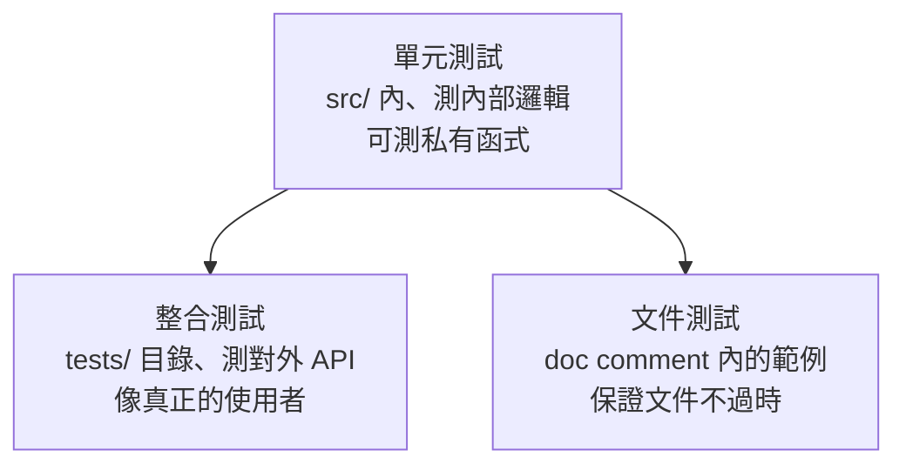

# 5.2 整合測試與文件測試

## 測試的三個層次

單元測試（5.1 節）測內部邏輯。Rust 另外有兩種內建測試，各自回答不同的問題：



## 整合測試：tests/ 目錄

整合測試放在專案根目錄的 **`tests/`** 目錄，每個檔案是獨立的 crate——**只能使用你的 crate 的公開 API（pub）**，像真正的使用者那樣呼叫：

```
my-lib/
├── Cargo.toml
├── src/
│   └── lib.rs
└── tests/
    └── api_test.rs      # 一個檔案 = 一個整合測試 crate
```

```rust
// tests/api_test.rs
use my_lib::Calculator;    // 只能用 pub 的東西

#[test]
fn calculator_works_end_to_end() {
    let c = Calculator::new();
    assert_eq!(c.add(2, 3), 5);
    assert_eq!(c.multiply(2, 3), 6);
}
```

```bash
cargo test           # 單元測試 + 整合測試 + 文件測試，全部執行
cargo test --test api_test    # 只跑某個整合測試檔
```

**單元測試與整合測試的分工**：

| | 單元測試 | 整合測試 |
|---|---|---|
| **位置** | `src/` 內 `#[cfg(test)]` | `tests/` 目錄 |
| **可見範圍** | 內部（含私有函式） | **只有 pub API** |
| **測什麼** | 個別函式的邏輯、邊界條件 | **公開介面的端到端行為** |
| **數量比例** | 多、小、快 | 少、大、接近真實使用 |

> 慣用法：**內部邏輯用單元測試；每個 pub 功能至少一個整合測試**。整合測試是「從使用者角度驗證 API 設計」的鏡子——**如果你的整合測試寫起來很痛苦，你的 API 設計可能有問題。**

## 文件測試：範例不會過時

複習 4.2 節：doc comment 中的程式碼區塊會被**當成測試執行**：

```rust
/// 把兩個數相加。
///
/// # 範例
///
/// ```
/// assert_eq!(my_lib::add(2, 3), 5);
/// ```
pub fn add(a: i32, b: i32) -> i32 {
    a + b
}
```

```bash
cargo test           # 文件測試一起跑
```

這解決了文件工程的經典問題：**文件範例過時**。API 改了、範例跑不過，測試就失敗——文件與程式碼永遠同步。

## 測試的 80/20 實務

1. **每個函式至少一個單元測試**，涵蓋成功路徑與主要錯誤路徑
2. **每個 pub 功能至少一個整合測試**，從使用者角度驗證
3. **pub 函式都寫 doc comment + 範例**，範例自動成為測試
4. **改 bug 前先寫一個會失敗的測試**（重現 bug），修好後它成為回歸測試

## 本章小結

- 測試三層：**單元測試（src/）、整合測試（tests/）、文件測試（doc 範例）**
- 整合測試**只能用 pub API**，像真正的使用者；寫得痛苦代表 API 設計有問題
- **文件範例會被當測試執行**，文件不會過時
- 改 bug 前先寫失敗的測試，修好後成為回歸測試

## 想一想

1. 單元測試與整合測試的分工是什麼？你的專案各需要多少？
2. 「整合測試寫得痛苦代表 API 設計有問題」——你的 pub API 從使用者角度看好寫嗎？
3. 為什麼「文件即測試」只有 Rust 這類工具鏈做得到？它的價值是什麼？
