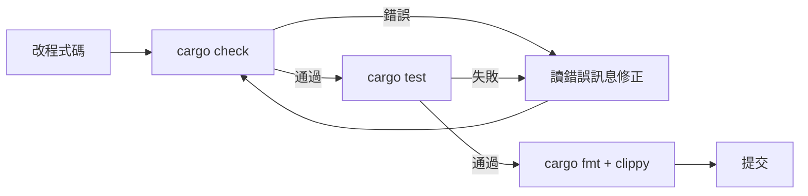

# 6.1 最常使用的 10 個 Cargo 命令

## 80/20 法則：這 10 個指令涵蓋日常 80% 的操作

| # | 指令 | 用途 |
|---|---|---|
| 1 | `cargo check` | 快速檢查能不能編譯——**開發循環最常用** |
| 2 | `cargo run` | 編譯 + 執行 |
| 3 | `cargo test` | 跑全部測試（單元 + 整合 + 文件） |
| 4 | `cargo build --release` | 正式建構（最佳化） |
| 5 | `cargo add <crate>` | 加入依賴 |
| 6 | `cargo clippy` | 官方 linter，抓低效與非慣用寫法 |
| 7 | `cargo fmt` | 官方格式化 |
| 8 | `cargo new <名稱>` | 建立新專案 |
| 9 | `cargo doc --open` | 產生並打開 API 文件 |
| 10 | `cargo update` | 更新依賴到相容範圍內最新版 |

## 每個指令的最小記憶卡

```bash
# 開發循環（一天之內跑幾十次）
cargo check            # 改完程式先 check，最快
cargo run              # 通過了就跑
cargo test             # 有測試就跑

# 提交前（品質關卡）
cargo fmt              # 統一風格
cargo clippy -- -D warnings   # lint，警告當錯誤

# 建構與部署
cargo build --release  # 正式產物在 target/release/
cargo run --release    # 正式模式執行

# 依賴與文件
cargo add serde        # 加依賴
cargo update           # 更新依賴
cargo doc --open       # 看文件
```

## 標準開發循環（背下來）



1. **`cargo check`**——最快的回饋迴圈
2. **`cargo test`**——正確性
3. **`cargo fmt` + `cargo clippy`**——風格與慣用寫法
4. **`cargo build --release`**——部署前最後驗證

## 常用速查：測試與除錯

```bash
cargo test                       # 全部測試
cargo test divide                # 名稱含 divide 的測試
cargo test -- --nocapture        # 顯示 println 輸出
cargo test -- --test-threads=1   # 依序執行（共用狀態時）
cargo run 2>&1 | less            # 看完整輸出
```

## 常用速查：常用 crate（生態地圖）

| 需求 | 慣用 crate |
|---|---|
| 錯誤處理（應用） | `anyhow` |
| 錯誤處理（庫） | `thiserror` |
| 序列化 JSON/YAML | `serde` + `serde_json` |
| 非同步執行時期 | `tokio` |
| Web 框架 | `axum` / `actix-web` |
| HTTP 客戶端 | `reqwest` |
| CLI 參數解析 | `clap` |
| 測試 mock 與斷言 | `mockall` / `assert_cmd` |
| 效能測試 | `criterion` |

> 選 crate 的原則：看下載量與維護狀態（crates.io 上的版本與更新時間）、文件品質（docs.rs）、以及是否為社群公認的慣用選擇。

## 本章小結

- 10 個指令涵蓋日常 80%：**check、run、test、build --release、add、clippy、fmt、new、doc、update**
- 標準開發循環：**check → test → fmt + clippy → 提交**
- 效能與部署一律 **`--release`**
- 生態地圖：錯誤處理 anyhow/thiserror、序列化 serde、非同步 tokio、Web axum

## 想一想

1. 遮住答案，你能默寫這 10 個指令嗎？
2. 你的標準開發循環是哪幾步？哪一步最容易偷懶跳過（卻最不該跳過）？
3. 挑一個需求（如 CLI 工具），用上表的 crate 組合出你的專案依賴。
