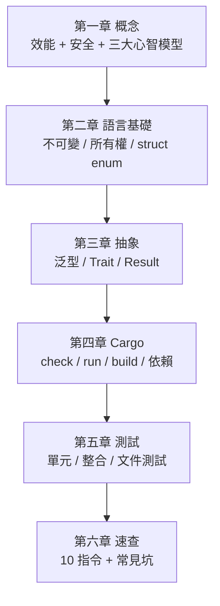

# 6.2 常見坑與清潔整理

## 初學者最常踩的坑

Rust 的學習曲線大部分來自「編譯器在擋你」。這些坑每個人都踩過——認識它們能少走很多冤枉路：

### 坑一：被搬移之後還想用

```rust
let s = String::from("hello");
let t = s;
println!("{}", s);        // ← 編譯錯誤：value moved
```

解法：要嘛 `s.clone()`（明確的複製成本），要嘛改用借用 `&s`（複習 2.2 節）。

### 坑二：同時有多個可變借用

```rust
let mut v = vec![1, 2, 3];
let a = &mut v;
let b = &mut v;           // ← 編譯錯誤：a 還在用
a.push(4);
```

解法：把借用範圍縮小——用完 `a` 之後再借 `b`（NLL 會自動判斷）。需要同時操作，表示資料結構該重新設計。

### 坑三：函式最後一行多寫了分號

```rust
fn add(a: i32, b: i32) -> i32 {
    a + b;                // ← 編譯錯誤：mismatched types
}
```

解法：刪掉分號（複習 2.1 節）。

### 坑四：Option/Result 沒處理就直接用

```rust
let n = find_user(42);
println!("{}", n.to_uppercase());   // ← 編譯錯誤：Option 沒有這個方法
```

解法：`match`、`if let`、或 `unwrap_or` 系列（複習 1.2 節）。

### 坑五：debug 模式下量測效能

```bash
cargo run                 # ← 慢幾十倍，benchmark 結論錯誤
cargo run --release       # ✓ 效能要在 release 下量測
```

### 坑六：編譯錯誤只看第一行

Rust 錯誤訊息的**精華在後面**——通常直接告訴你「這樣改就行」：

```bash
cargo check 2>&1 | less   # 完整閱讀錯誤訊息
```

## 清潔整理：target/ 目錄

Rust 唯一會暴漲的空間是 **`target/`**（建構產物，切換 branch、改依賴後會累積舊產物）：

```bash
du -sh target/          # 看看吃了多少（大專案可能數十 GB）
cargo clean             # 全部清除（下次 build 要重新編譯）
```

| 情境 | 解法 |
|---|---|
| 磁碟滿了 | `cargo clean`，或刪掉舊專案的 target/ |
| 切 branch 後行為怪怪的 | `cargo clean` 後重新建構 |
| 多專案共用建構快取 | workspace（共用 target/，複習 4.3 節） |
| IDE 卡卡 | 確認 rust-analyzer 有在跑，別同時開多個 |

> 工具推薦：**`cargo install cargo-cache`** 提供 `cargo cache` 指令，方便管理 `~/.cargo` 下的依賴快取。

## 全書總結：Rust 極最小知識地圖



- **三大心智模型**：所有權、Option（無 null）、Result（無例外）
- **語言基礎**：預設不可變、Move 與借用鐵律、struct/enum + match 窮盡性
- **抽象**：泛型 + trait bound、靜態分發優先、`?` 傳播錯誤
- **Cargo**：check → test → fmt + clippy 的開發循環，Cargo.lock 鎖版本
- **測試**：單元測試同檔案、整合測試測 pub API、文件範例即測試
- **日常**：10 個指令 + 六大常見坑

你已經掌握了 Rust 的最小可行知識。剩下的 20%（生命週期標註、非同步 tokio、unsafe、巨集、智慧指標），等實務需要時再學也不遲。

## 想一想

1. 六個常見坑中，你已經踩過哪幾個？解法記住了嗎？
2. 把你的 Rust 專案整理一次：跑 `cargo fmt`、`cargo clippy`、補上缺失的測試。
3. 下一步想學哪一個進階主題？為什麼？（提示：跟著實務需要走，不要為學而學）
